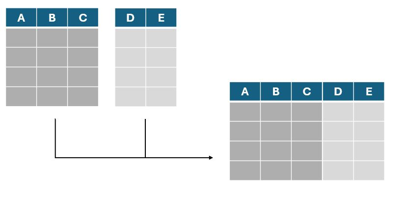
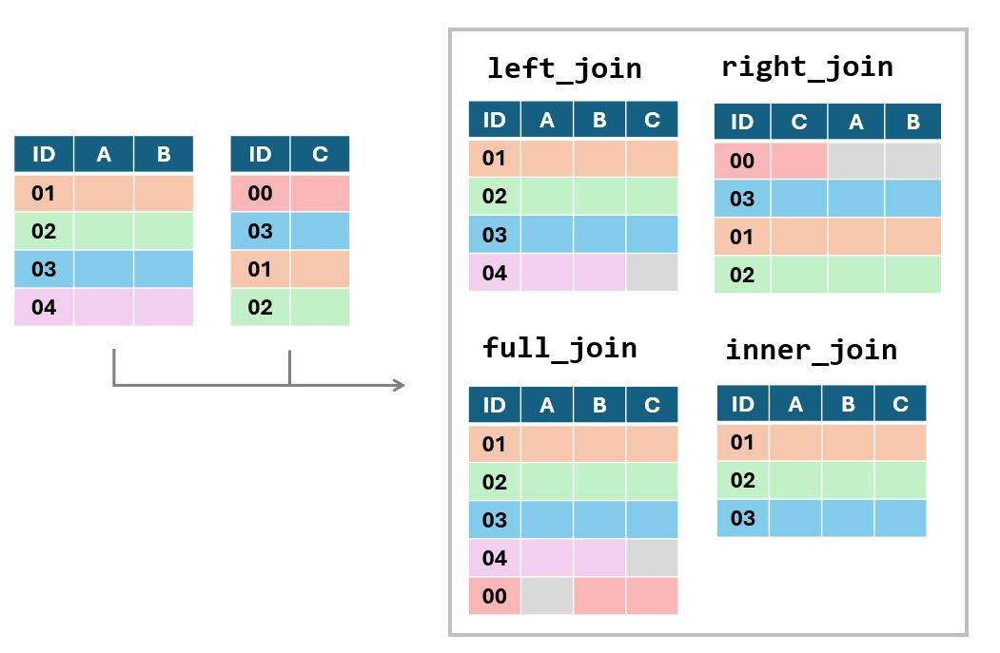

<!-- the above should be in the beginning of each lesson -->

<!-- code to format so all text appears rtl (Hebrew) -->

```{=html}
<style>
h1, h2, h3, h4, h5, h6 {
  direction: rtl;
}
p {
  direction: rtl;
}
</style>
```
<!-- tutorial options and cheching options - TODO set params -->

```{r setup, include=FALSE}
library(learnr)

tutorial_options(
  exercise.timelimit = 60,
  # A simple checker function that just returns the message in the check chunk
  exercise.checker = function(check_code, ...) {
    list(
      message = eval(parse(text = check_code)),
      correct = logical(0),
      type = "info",
      location = "append"
    )
  }
)


knitr::opts_chunk$set(error = TRUE)
```

```{r prepare-df1}


```

```{r prepare-rbind}


```

```{r prepare-table2}
table2 = nfc %>%
  mutate(nfc_02 = 6 - nfc_02r,  # נהפוך את הקידוד של שלושת העמודות ההפוכות
         nfc_03 = 6 - nfc_03r,
         nfc_06 = 6 - nfc_06r,
         # נחשב את ממוצע ששת השאלות.
         # שימו לב - אפשר להשתמש בעמודות שיצרנו מוקדם יותר בתוך הפונקציה
         nfc    = (nfc_01 + nfc_02 + nfc_03 + nfc_04 + nfc_05 + nfc_06)/6,
         
         age_above_18 = age >=18,  # האם הנבדק מעל גיל 18
         
         gender = recode(gender, "male" = "M", "female" = "F"), # דריסת עמודת המגדר וקידוד מחדש של הערכים שנמצאים בה
                     # פונקציה זו מאפשר לנו לקודד מחדש עמודות עם מספר רמות - להחליף את הערכים המייצגים קבוצות שונות 
         
         # תקנון ציוני המדד ויצירת ציוני תקן - באופן שמתעלם מערכים חסרים
         nfc_Z_score = (nfc - mean(nfc,na.rm = T)) / sd(nfc, na.rm = T)  
         
         )
```

## dplyr מבוא

בשיעור זה נלמד להשתמש במגוון רחב של פונקציות המאוגדות תחת החבילה dplyr.

פונקציות אלו מאוד נפוצות בשימוש בR כיוון שהן מאפשרות לעבד קבצי נתונים
באופן פשוט ומסודר. בחלק מהמקרים הפונקציות שנפגוש יאפשרו לנו לעשות דברים
שכבר למדנו איך לעשות בשיעורים הקודמים (משל - חיתוך של שורות או עמודות
מתוך טבלה) אך הן יעשו זאת באופן שיאפשר לנו לשמור את הקוד שלנו קריא
ותמציתי. במקרים אחרים נפגוש פונקציות שמאפשרות לנו לעשות עיבודים חדשים
שעוד לא פגשנו.

השיעור ארוך יותר מהשיעורים הקודמים, אך הוא נוגע בתחום מרכזי מאוד בשימוש
בתוכנה ולכן מומלץ להקדיש לו זמן וקשב, שכן אלו פונקציות שנמצאות בשימוש
תדיר בעיבוד נתונים.

### פקד ההעברה

לפני שנגיע לשימוש בפונקציות עצמן, נרצה להתעכב על פקד חדש הנכלל בחבילה
זו - פקד ההעברה (או באנגלית - piping). פקד זה מיוצג על ידי הסימון %\>%
ואפשר לחשוב עליו כעל צינור שמעביר את מה שלפניו לפונקציה שאחריו.

למשל, בדוגמה הבאה הפקד מעביר את הוקטור scores לתוך הפונקציה mean(). כל
צמד של שורות קוד (עם ובלי פקד ההעברה) מבצעים את אותה הפעולה בדיוק.

```{r e1, exercise=TRUE, exercise.eval = FALSE, , exercise.setup = "prepare-df1"}

scores = c(80,75,60,94,81,72,93,52,98,62,82,90,73,75,63,82,76,97,61,75,84,80,95)

# חישוב הציון הממוצע
mean_score = mean(scores)
mean_score = scores %>% mean()

# חישוב הרבעונים
scores_quartiles = quantile(scores, probs = c(0.25,0.5,0.75))
scores_quartiles = scores %>% quantile(probs = c(0.25,0.5,0.75))


```

#### למה זה טוב?

כל עוד אנחנו משתמשים בפונקציה אחת, אין לשימוש בפקד זה יתרון משמעותי.
היתרון העיקרי מגיע כשאנחנו רוצים להשתמש בכמה פונקציות ברצף. במקרים כאלו,
אנחנו יכולים להכניס את התוצר של כל פונקציה בתוך הפונקיה הבאה, אבל כתיב
כזה ייצר קוד מאוד מסורבל. הפקד מאפשר לנו לכתוב את אותו הקוד באופן הרבה
יותר מסודר ונח לקריאה. נוכל גם לרווח את הקוד לשורות שונות ולהוסיף הערות
שיעזרו לנו לזכור מה עושה כל שלב בניתוח.

במקום פקד ההעברה, יכולנו לבצע את כל שלבי החישוב בנפרד, לשמור את התוצרים
של כל פונקציה כאובייקט חדש ולהשתמש בו בפונקציה הבא - אך דרך זו היא גם
יותר מסורבלת וגם "מזהמת" את סביבת העבודה שלנו עם הרבה אובייקטים מיותרים

שימו לב - כשאנחנו משתמשים בפקדי העברה, תוצרי הביניים של הפונקציות לא
נשמרים. התוצר היחיד שישמר הוא התוצר של הפונקצייה האחרונה בשרשרת, והוא
יישמר תחת שם האובייקט שאליו ביצענו את ההשמה - \*).

בקטע הקוד הבא ישנן מספר דוגמאות ותרגיל

```{r e2, exercise=TRUE, exercise.eval = FALSE, , exercise.setup = "prepare-df1"}

scores = c(80,75,60,94,81,72,93,52,98,62,82,90,73,75,63,82,76,97,61,75,84,80,95)

# דוגמה ראשונה - חישוב הטווח הבין רבעוני

# שמירה של תוצרי הביניים כאובייקטים - מזהם את סביבת העבודה באובייקטים מיותרים
Q1_and_Q3 = quantile(scores, probs = c(0.25,0.75))  # חישוב ערכי הרבעון הראשוןם והשלישי
inter_quartile_range = diff(Q1_and_Q3)              # חישוב ההפרש בין ערכי הרבעונים

# שימוש בפונקציות שונות אחת בתוך השנייה
inter_quartile_range = diff(quantile(scores, probs = c(0.25,0.75)))

# שימוש בפקד ההעברה
inter_quartile_range = scores %>% 
  quantile(probs = c(0.25,0.75)) %>% # חישוב ערכי הרבעון הראשוןם והשלישי
  diff()                             # חישוב ההפרש בין ערכי הרבעונים


# דוגמה שנייה - דפסת הציון הממוצע אחרי עיגול

# ללא פקד ההעברה
print(paste("The mean score is",round(mean(scores),1)))

# עם פקד ההעברה
scores %>%
  mean()%>%                      # חישוב הממוצע
  round(1) %>%                   # עיגול הממוצע שחושב לספרה אחת אחרי הנקודה העשרונית
  paste("The mean score is",.)%>%# הדבקת התוצאה יחד עם קטע טקסט קצר
  print()                        # שימו לב: ניתן להשתמש בנקודה כדי לסמן את המיקום שבו  
                                 # נרצה להכניס את התוצר מהפונקציה הקודמת, במידה ולא מדובר
                                 # בהכרח במיקום הראשון בפונקציה


######   תרגיל  ######

# כתבו מחדש את החישוב הבא באמצעות פקדי העברה

numbers_as_text = c("12","14","15","7","34","22","17")

median_number = median(as.numeric(numbers_as_text))

median_number = _________________________________

```

-   

## בחירת עמודות, סינון שורות וסידור טבלאות

כעת ניגש לפונקציות של חבילת dplyr. הפונקציות הראשונות בהן נשתמש מבצעות
פעולות שכבר התנסנו בהם. למשל - הפונקציה select() מאפשרת לנו לייצר טבלה
חדשה מתוך העמודות של טבלה קיימת. אנחנו יכולים לציין את שמות העמודות
שאנחנו רוצים להשאיר - או לציין בליווי מינוס את העמודות שאנחנו רוצים
לסלק.

כך או כך, הפונקציה מייצרת טבלה *חדשה* מתוך החיתוך שעשינו. היא אינה עורכת
את הטבלה המקורית שהכנסנו לפונקציה. לכן - נצטרך לשמור את האובייקט
שהפונקציה מחזירה כדי לקבל את הטבלה הערוכה.

במידה ואנחנו רוצים לערוך את אותה הטבלה אנחנו יכולים לשמור את הטבלה
המעודכנת תחת שמה של הטבלה המקורית ובכך לדרוס את הגרסה הישנה ולהחליף אותה
במעודכנת.

להלן מספר דוגמאות:

```{r e3, exercise=TRUE, exercise.eval = FALSE, , exercise.setup = "prepare-df1"}

# נשתמש בטבלה שייבאנו בשיעור הקודם, המכילה את נתוני שאלון 
# need for cognition

table1 = need_for_cognition

# בחירת העמודות המציינות את מספר ההרצה, את מין הנבדק ואת הגיל שלו
demographic_data = table1 %>% select(session_id,age,gender)

# השמטת העמודה הראשונה ועמודות בדיקת העירנות
table2 = table1 %>% select(-1,-attention_check)

# עדכון הטבלה שיצרנו כך שלא תכיל את נתוני הגיל
table2 = table2 %>% select(-age)                    # אם תריצו את שורה זו פעמיים ברצף תקבלו הודעת שגיאה. נסו להבין מדוע
```

יישום שימושי נוסף של פונקציה זו הוא שהיא מאפשרת לבחור עמודות על סמך
התוכן של שמות העמודות. למשל - באמצעות הפונקציה contains() נוכל לבחור את
כל העמודות המכילות רצף תווים מסויים. אפשרות זו שימושית כשאנחנו רוצים
לבחור קבוצה של עמודות ששמרנו בשם דומה - למשל תשובות לשאלות שונות באותו
השאלון.

בדוגמה למטה אנחנו חותכים מתוך הטבלה הכללית שלנו תת-טבלה המכילה רק את
התשובות לשאלון ואת המספר המזהה של התגובה של כל נבדק

```{r e4, exercise=TRUE, exercise.eval = FALSE, , exercise.setup = "prepare-df1"}

table1 = need_for_cognition

questions_and_sesion_id = table1 %>% select(session_id,contains("nfc"))
                
```

שימו לב - כשנבצע בחירת עמודות באמצעות select)( נקבל חזרה טבלה - גם אם
בחרנו רק עמודה אחת. במידה ונרצה לבצע חיתוך של עמודה בודדת כוקטור ולא
כטבלה נוכל להיעזר בפקד ה\$, או להשתמש בפקודה pull() המבצעת פעולה דומה.
בדוגמה הבאה אנו נעזרים בפקודה זו על מנת לבחון מה הם הערכים השונים
המוכלים בעמודה gender, פעולה נפוצה כחלק מהבנת המבנה של טבלה חדשה.

```{r e5, exercise=TRUE, exercise.eval = FALSE, , exercise.setup = "prepare-df1"}

table1 = need_for_cognition

table1 %>% pull(gender) %>% # שליפת העמודה המכילה את נתוני המגדר
  unique() %>%              # פונקציה המשיבה וקטור שמונה את הערכים השונים הקיימים בוקטור
  print()                   # הדפסה

# ניתן לראות שהעמודה מכילה ערכים המעידים על נבדקים זכרים, נקבות וערכים חסרים כלשהם
                
```

### filter

עכשיו שכיסינו את חיתוך עמודות - נוכל לעבור לעיסוק המשלים: סינון שורות.

גם כאן נוכל לבחור או להשמיט שורות לפי המספר הסידורי שלהם, באמצעות הפקודה
slice() , אך ברוב המקרים סינון השורות שנרצה לבצע יהיה תלוי בתוכן של
השורות עצמן ולא במספר הסידורי שלהן.

למשל - ייתכן ונרצה לסנן מתוך קובץ הנתונים שלנו את כל הנבדקים שלא סיימו
את הניסוי, הנבדקים שנמצאים מחוץ לטווח גילאים מסויים או שחסרים להם נתונים
חשובים.

בשביל פעולות כאלו, שהינן תנאי הכרחי כמעט בכל ניתוח שנערוך, ניעזר
בפונקציה filter().

פונקצייה זו מקבלת את הטבלה עליה נרצה לבצע את הסינון (באופן ישיר או
באמצעות פקד ההעברה), ותנאי לוגי שיקבע אילו שורות ישארו. תנאי זה יתבסס על
עמודה אחת או יותר מתוך הטבלה.

להלן מספר דוגמאות:

```{r e6, exercise=TRUE, exercise.eval = FALSE, , exercise.setup = "prepare-df1"}

table1 = need_for_cognition

filtered_table1 = table1 %>%
  filter(attention_check == 1) # שמירת כל הנבדקים שעמדו בבדיקת תשומת הלב בניסוי

filtered_table2 = table1 %>%
  filter(age >20 & age <=30) # שמירת כל הנבדקים בין גילאי 20 ו30 (כולל)

filtered_table4 = table1 %>%     # שילוב של כל התנאים הנ"ל
  filter(attention_check == 1 &
           age >20 & age <=30 &
           !is.na(gender)) 
                
```

שימו לב שבחלק מהסינונים לעיל השתמשנו במנספר תנאים לוגיים ששולבו יחד. גם
בבחירת טווח הגילאים וגם בשילוב בין כל התנאים השתמשנו בפעולת ה"וגם" (AND)
ששומרת רק את מי שעונה על שני הקריטריונים. פעולה שימושית נוספת הינה
\*\*\* \| ?

תרגיל : סננו את הקובץ כך שיכיל רק תצפיות של נשים מעל גיל 30 וגברים מעל
גיל 25

```{r e7, exercise=TRUE, exercise.eval = FALSE, , exercise.setup = "prepare-df1"}

table1 = nfc

# גברים מעל גיל 25 ונשים מעל גיל 30 
female_or_male_by_age = table1 %>% filter(___________) #*
             
```

#### ערכים חסרים

בעבודה עם נתוניים אמיתיים, שנאספו בניסוי או בסקר, במקרים רבים אנחנו נתקל
בנתונים חסרים. החוסר יכול לנבוע מכך שנבדק פספס שאלה מסוימת או נפסל באחד
הסבבים של מטלה, או שהייתה בעיה כלשהי בשמירת הנתונים שלו יהיו מקרים בהם
החוסר יגרור פסילה של שורות שלמות מהנתונים שלנו, אך לא תמיד נרצה לוותר
לגמרי על שורות שלמות בגלל כמה נתונים חסרים. כשהנתון החסר קריטי אין לנו
הרבה ברירה מלבד למחוק את השורה כולה, אך לפעמים נעדיף להשאיר אותה והשתמש
בה בניתוחים בהם יש לתצפית זו מספיק נתונים כדי להיות שימושית.

במידה ונבחר למחוק את השורה, נוכל לעשות זאת באמצעות הפונקציה drop_na.

להלן מספר דוגמאות:

```{r e8, exercise=TRUE, exercise.eval = FALSE, , exercise.setup = "prepare-df1"}

table1 = nfc

# פונקציה זו מקבלת את שמות העמודות שעל בסיסן נרצה להשמיט את הנתונים.
# בדוגמה זו השמטנו שורות  בהן הערך בעמודת המגדר היה חסר
table2 =  table1 %>% drop_na(gender)
nrow(table2)

# באותו האופן, ניתן להשמיט שורות שיש בהן ערך חסר *בעמודה אחת לפחות* מתוך העמודות שציינו
table3 =  table1 %>% drop_na(gender, nfc_01, nfc_02r, nfc_03r)
nrow(table3)

# או להשמיט שורות שיש בהן תצפית חסרה כלשהי, בעמודה כלשהי
table4 = table1 %>% drop_na()
nrow(table4)


```

ברוב המקרים אנחנו נרצה למחוק את השורות עם הערכים החסרים או להשאיר את
הערכים החסרים כפי שהם ולהתעלם מהם בניתוחים שמערבים רותם, אך לפעמים נרצה
לשמור את אותן שורות ולמלא את הערכים החסרים בערכים תקינים כלשהם.

במקרים כאלו אנחנו יכולים להחליף את הערכים החסרים בערך קבוע כלשהו או
ל"מלא" את הערכים החסרים בערכים מהשורה מעל או מתחת לערך החסר.

לדוגמא:

```{r e9, exercise=TRUE, exercise.eval = FALSE, , exercise.setup = "prepare-df1"}

table1 = nfc

# 
table2 = table1 %>% replace_na(list(gender= "other")

#
fill(direction = "up")


```

#### ערכים כפולים

לעיתים, במיוחד כשאנחו עוסקים במידע שצורף ממספר מקורות שונים הטבלאות שלנו
עלולות להכיל כפל של נתונים. ייתכן, למשל, ששילבנו יחד שני קבצים שבשניהם
הופיעה אותה תצפית. לטובת מקרים כאלו קיימת הפקודה distinct)(, שתפקידה
לסנן תצפיות כפולות. הפונקציה תקח את הטבלה שלנו, תעבור על כל השורות ותמחק
שורות שמהוות כפילות.

בברירת המחדל, הפונקציה תמחק רק תצפיות המהוות כפילות מוחלטת - תצפיות בהן
כל הערכים בכל העמודות זהים בין השורות. במטידה ואנחנו מעוניינים בסינון של
כפילויות חלקיות אפשר לעשות זאת באמצעות ציון שמות העמודות על בסיסן נרצה
לסנן.

להלן מספר דוגמאות:

```{r e10, exercise=TRUE, exercise.eval = FALSE, , exercise.setup = "prepare-df1"}
# בקובץ המקורי אין כפילויות, ולכן נייצר טבלה עם מספר כפילויות לצורך ההדגמה
table1 = nfc[c(1:1000,36,207,6),]

nrow(nfc) # מספר השורות לפני מחיקת כפילויות

table2 = nfc %>%
  distinct()

nrow(table2) # מספר השורות אחרי מחיקת כפילויות

# מחיקת כפילויות על בסיס עמודות מסוימות בלבד
# הפונקציה תשמור את השורה הראשונה מתוך השורות שיחשבו ככפילות
table3 = nfc %>%
  distinct(session_id, .keep_all = TRUE) # ללא התוספת בסוף הפונקציה התוכנה תחזיר טבלה המכילה רק את העמודות שצוינו

```

### פונקציות נוספות

#### rename

חבילת dplyr מספקת לנו גם דרך פשוטה לשנות את שמות העמודות שלנו. כמו כל
הפונקציות הקודמות שפגשנו, גם כאן הפונקציה *אינה עורכת* את הטבלה המקורית,
אלא מייצרת עותק ערוך שלה אותו נצטרך לשמור. הפונקציה מקבלת פירוט של השמות
החדשים שנרצה לתת לעמודות בליווי שמן הנוכחי.

```{r e11, exercise=TRUE, exercise.eval = FALSE, , exercise.setup = "prepare-df1"}

table1 = nfc

table2 = nfc %>%
  rename(subject  = session_id,
         sex = gender)
        #new_name = old_name

names(table2)

```

#### Arrange

פונקציה נוספת העשויה לעזור לנו בסידור הנתונים שלנו היא הפונקציה arrange.
פונקציה זו תחזיר נו את הטבלה כשהיא מסודרת בסדר עולה או יורד על פי עמודה
אחת או יותר. הפונקציה תסדר וקטורים מספריים לפי סדר הערכים ווקטור המכיל
תווים לפי סדר הא' ב'.

במידה ונרצה להפוך את סדר המדרג נוכל להשתמש בפונקציה desc()

```{r e12, exercise=TRUE, exercise.eval = FALSE, , exercise.setup = "prepare-df1"}

table1 = nfc

table2 = table1 %>%
  arrange(age)    # סידור לפי גיל

table3 = table1 %>%
  arrange(desc(session_id))  # סידור לפי מספר הרצה, בסדר יורד

table4 = table1 %>% 
  arrange( gender, age)  # סידור לפי מגדר - ואז לפי גיל

```

## עריכת נתונים

הפעולות העיקריות שנעשה בניתוח נתונים כוללות עריכה של הנתונים עצמם. כדי
שנוכל לערוך את המבחנים הסטטיסטיים שמעניינים אותנו או לייצר תרשימים
רלוונטיים נצטרך להפיק מהנתונים הגולמיים שלנו מדדים, ,לסכם אותם ולחבר
אותם עם נתונים נוספים.

בפרק הנוכחי נעבור על הפעולות הבסיסיות שנדרשות מאיתנו כחלק מתהליך זה

### חישוב עמודות - mutate

הפונקציה הנפוצה ביותר בתהליך עיבוד הנתונים היא הפונקציה mutate. פונקציה
זו מאפשרת לנו להגדיר עמודות חדשות או לערוך עמודות קיימות - באופן דומה
לעריכה שעשינו באמצעות פקד ה\$. בשילוב עם מספר פונקציות בסיסיות, פונקציית
הmutate מאפשרת לנו לערוך אתהעמודות שבטבלה שלנו במגוון רחב של דרכים.
הפונקציה מאפשרת לנו לערוך מספר עמודות בבת אחת, כאשר החישוב של כל עמודה
מופרד בפסיק ממשנהו.

להלן מספר דוגמאות:

```{r e13, exercise=TRUE, exercise.eval = FALSE, , exercise.setup = "prepare-df1"}

table1 = nfc

table2 = table1 %>%
  mutate(nfc_02 = 6 - nfc_02r,  # נהפוך את הקידוד של שלושת העמודות ההפוכות
         nfc_03 = 6 - nfc_03r,
         nfc_06 = 6 - nfc_06r,
         # נחשב את ממוצע ששת השאלות.
         # שימו לב - אפשר להשתמש בעמודות שיצרנו מוקדם יותר בתוך אותה הפונקציה
         nfc    = (nfc_01 + nfc_02 + nfc_03 + nfc_04 + nfc_05 + nfc_06)/6,
         
         age_above_18 = age >=18,  # האם הנבדק מעל גיל 18
         
         gender = recode(gender, "male" = "M", "female" = "F"), # דריסת עמודת המגדר וקידודה מחדש 
                     # פונקציה זו מאפשר לנו לקודד מחדש עמודות עם מספר רמות - להחליף את הערכים המייצגים קבוצות שונות 
         
         # תקנון ציוני המדד ויצירת ציוני תקן - באופן שמתעלם מערכים חסרים
         nfc_Z_score = (nfc - mean(nfc,na.rm = T)) / sd(nfc, na.rm = T)  
         
         )
# שימו לב לסוגריים - כל העמודות שיצרנו בוכנסו בתוך פונקצייה אחת, בה הפרדנו את ההתייחסות לכל עמודה בפסיקים.
# ירידת השורה בין עמודה לעמודה נועדה כדי לשמור על הסדר ואינה נדרשת בשביל תקינות הקוד
```

דרך פונקציה זו נוכל גם לעדכן את סוג העמודות (מספרי, תווים, ערכים לוגיים,
פקטור), לחלק לקבוצות על סמך ערך מספרי או לערוך עמודות על פי תנאי

```{r e14, exercise=TRUE, exercise.eval = FALSE, exercise.setup = "prepare-table2"}

table3 = nfc %>% #*
  mutate(gender_factor = factor(gender),             # יצרנו גרסת פקטור של נתוני המגדר
         gender_numeric = as.numeric(gender_factor), # יצרנו עמודה מספרית על סמך העמודה הקודמת (תכיל 0 ו1)
         
         age_category = cat(age,                     # יצירת עמודת קבוצות גיל
                            breaks = c(0,18,30,50,120),
                            labels = c("youth","young adult","adult","senior")),
         
         # במידה וגילינו שנפלה טעות ונתוני הגיל של הנשים במדגם שלנו קטנים ב5 מהערכים האמיתיים
         # נרצה לערוך רק את נתוני הגיל של נשים. הפונקציה הבאה מאפשרת לנו לבצע עריכה שכזו
         corrected_age = ifelse(gender == "F",
                                age+5 , # ערכנו את נתוני הגיל של נשים
                                age)    # והשארנו את נתוני הגיל כפי שהם עבור מי שאינו אישה
         )
```

### שימוש בפרמטרים קבוצתיים

באחת הדוגמאות הקודמות חישבנו את ציוני התקן במדד הnfc. לצורך החישוב
נעזרנו בפונקציות המחשבות את ממוצע המדד וסטיית התקן שלו. פונקציות אלו
מחשבות את הממוצע וסטיית התקן על פני כל התצפיות שלנו, ולכן הן מתאימות
לחישוב של ציוני התקן הכלליים.

ייתכן והקובץ שלנו יכיל נתונים מכמה קבוצות שונות, ונרצה לתקנן כל קבוצה
בנפרד. למשל - יכול להיות שאנחנו מעוניינים לבחון את התפלגות ה\*\*\* .
במקרים כאלו נצטרך להורות לתכנה לבצע את חישוב הממוצע וסטיית התקן לכל
קבוצה בנפרד. הפונקצייה שתשמש אותנו לשם כך נקראת group_by.

פונקציה זו מקבלת טבלה ומחזירה לנו טבלה שנראית זהה בדיוק, אך היא מוגדרת
כך שכל פעולה קבוצתית שנעשה תיעשה לפי הקבוצות שהגדרנו. אם נרצה לבטל את
החלוקה לקבוצות נצטרך לבצע זאת באמצעות פעולה מפורשת.

לפניכם מספר דוגמאות \*\*

```{r  ee14, exercise=TRUE, exercise.eval = FALSE,}

x = 1

```

##סיכום נתונים

המקרה הנפוץ יותר בו נרצה לחשב את ממוצעי הקבוצות בנפרד יהיה עבור סיכומי
נתונים. למשל - אחרי שחישבנו את ציון הnfc עבור כל נבדק, נרצה לחשב את
הממוצע וסטיית התקן במדד זה במדגם שלנו. במקרים כאלו ניעזר באותה הפונקציה
כדי לקבץ את הנתונים לקבוצות, ואחריה נשתמש בפונקציה summarise כדי להפיק
את הסיכומים שאנחנו צריכים. כמו mutate, גם פונקציה זו יודעת לחשב מספר
מדדים בתוך פונקציה אחת, אותם נפריד בפסיק. הפלט של הפונקציה יהיה טבלה,
המכילה עמודה אחת לכל סיכום שביקשנו מהפונקציה להפיק בנוסף לעמודות עבור
המדדים שעל פיהם קיבצנו את הנתונים. מספר השורות בטבלה זו יהיה קטן יותר
מאשר בטבלה המקורית שלנו, שכן כל קבוצה תיוצג על ידי שורה אחת בלבד.

להלן דוגמה:

```{r summary11, exercise=TRUE, exercise.eval = FALSE, , exercise.setup = "prepare-table2"}

summary_table = table2 %>% 
  group_by(gender)%>%
  summarise(mean_nfc = mean(nfc, na.rm = T),# חישוב ממוצע המדד עבור כל קבוצה
            sd_nfc   = sd(nfc,na.rm = T),   # חישוב סטיית התקן עבור כל קבוצה
            n_total = length(nfc),          # ספירת כלל התצפיות
            n_subjects = sum(!is.na(nfc)),  # ספירת התצפיות שאינן חסרות
            n_na = sum(is.na(nfc))          # ספירת התצפיות החסרות
  )

print(summary_table)
```

שימו לב - מאחר ועמודת המגזר שלנו מכילה ערכים חסרים, התוכנה התייחסה אליהם
כאל קבוצה נוספת וחישבה את מדדי הסיכום גם עבורם.

```{r numeric_quiz, echo = FALSE}
question_numeric(
  "מה היה ממוצע מדד nfc אצל הנשים במדגם?",
         answer("3.15", correct = TRUE),
         allow_retry = TRUE
)

question_numeric(
  "כמה תצפיות חסרות היו במדד הnfc אצל גברים?",
         answer("14", correct = TRUE),
         allow_retry = TRUE
)


question_numeric(
  "כמה נבדקים יש בקובץ שערך המגדר שלהם חסר, אבל הציון שלהם במדד nfc תקין?",
         answer("23", correct = TRUE),
         allow_retry = TRUE
)

```

בדוגמה הקודמת סיכמנו על סמך עמודה אחת בלבד. במידה ונרצה לסכם לפי תתי
קבוצות ממספר עמודות (למשל - גברים מבוגרים, גברים צעירים, נשים מבוגרות
ונשים צעירות), נוכל להכניס עמודות נוספת לפונקציית הgroup_by

השלימו את הקוד הבא בהתאם להערות

```{r summary2, exercise=TRUE, exercise.eval = FALSE, , exercise.setup = "prepare-table2"}

summary_table2 = table2 %>% 
  # נייצר עמודה נוספת המבחינה בין נבדקים מעל ומתחת לגיל 30
  mutate(over_30 = ifelse(age >30,"over 30","30 or under")) 
  group_by(gender, over_30)%>%
  summarise(n_observations =                , #  (כולל ערכים חסרים)מספר התצפיות  הכולל בתת הקבוצה
            mean_nfc =                      , #  ממוצע ציון המדד, תוך התעלמות מערכים חסרים
            percent_attention_valid =         # אחוז הנבדקים שעברו את מבחן הקשב (ציון 1 ולא 0)
  )

print(summary_table2)
```

## צירוף נתונים

הנושא הבא שנתעסק בו כולל צירוף של נתונים מכמה טבלאות שונות. לא נדיר
שבמחקר בפסיכולוגיה אנחנו נדרשים לצרף יחד נתונים מכמה מקורות. למשל -
ייתכן ונריץ ניסוי שבו הנבדקים משתתפים במטלה קוגנטיבית כלשהי ובסופה
ממלאים מספר שאלונים. בניתוח של נתונים כאלו נרצה להפיק לכל נבדק ציונים
במדדים שונים על בסיס תשובותיהם בשאלונים ולחבר אותן יחד עם מדדים הקשורים
בביצועים שלהם במטלה. דוגמה נוספת היא מצב בו יש לנו נתונים מאותו המחקר
בכמה קבצים שונים, כיוון שהוא נערך על ידי כמה מעבדות / בכמה עמדות שונות.

ישנם כמה צורות שונות בהן מנוכל לחבר את קבצי הנתונים שלנו:

1)  צירוף טבלאות

2)  הצלבת תצפיות

### צירוף טבלאות

במידה ויש לנו 2 טבלאות אם אותן עמודות, אך עם תצפיות שונות - נוכל לאחד את
השורות מהטבלאות השונות לכדי טבלה אחת ארוכה. אפשר לחשוב על פעולה זו כאל
הדבקה של השורות מטבלה אחת בסופה של הטבלה השנייה.

{width="500"}

הפונקצייה שתשמש אותנו לשם כך נקראת bind_rows.

להלן דוגמה:

```{r e115, exercise=TRUE, exercise.eval = FALSE, exercise.setup = "prepare-rbind"}

full_df =  bind_rows(df_partial1, df_partial2)

# במידה וישנן עמודות שקיימות רק באחת מהטבלאות, הפונקצייה תמלא את עמודה זו בערכים חסרים עבור כל התצפיות של הטבלה השנייה

full_df_with_na = bind_rows(df_partial1 %>% mutate(extra_col = "a"), # הוספנו עמוד נוספת לאחת הטבלאות, שלא קיימת בטבלה השנייה
                            df_partial2)


```

באופן דומה - ניתן גם לצרף עמודות מטבלאות שונות. הפעם נצטרך שהטבלאות יהיו
באותו האורך, והצירוף שלהן "ידביק" אותן זו לצד זו.

{width="500"}

```{r e16, exercise=TRUE, exercise.eval = FALSE, , exercise.setup = "prepare-rbind"}

full_df =  bind_cols(df_first_columns, df_last_columns)


```

### הצלבת תצפיות

צירוף שורות או עמודות הוא צירוף "טיפש", כלומר - הוא לא לוקח בחשבון את
התוכן של הטבלאות. הוא גם מתבסס על ההנחה שהטבלאות מסודרות באופן זהה, כך
שהדבקה פשוטה שלהן זו לצד זו, או זו אחרי זו, תייצר טבלה קוהרנטית.

במקרים רבים נרצה להצליב ולצרף נתונים מטבלאות שאינן דווקא בעלות מבנה זהה.
ציינו דוגמה שכזו בתחילת הפרק - הצלבה של נתוני שאלונים עם תוצאות במטלה.
בשביל צירוף כזה אנחנו נצטרך לצרף את הנתונים על סמך סימן מזהה כלשהו -
למשל, על סמך מספר נבדק. אנחנו נרצה שהתוכנה תעבור על הקבצים, תמצא תצפיות
בעלות אותו מספר נבדק ותשלב אותן יחד.

למעשה, יש כמה דרכים שבהן אפשר לבצע את הפעולה הזו.

האפשרויות שלנו הן:

1)  להשאיר טבלה אחת כפי שהיא, ולצרף אליה את התצפיות המתאימות מהטבלה
    השנייה.

כשהפונקצייה לא תמצא תצפית מתאימה היא תשאיר את השורה מהטבלה המקורית ותצרף
אליה ערכים חסרים עבור העמודות שצורפו לטבלה. במידה והפונקציה תמצא יותר
משורה אחת עם אותו ערך מזהה ,היא לא תוכל לדעת איזו מהן עליה לצרף לשורה
המקורית ולכן היא תחזיר הודעת שגיאה.

כדי לבצע חיבור שכזה נשתמש בפונקציות left join או right_join.

*דוגמה* + שגיאה

2)  להשאיר את כל התצפיות משני הטבלאות ולמלא את הטבלה בערכים חסרים בשורות
    בהן אין התאמה בין הטבלאות

הגישה הזו מבטיחה לנו שלא "נשכח" אף תצפית מאחור, גם אם הערך המזהה שלה
קיים רק באחד הקבצים. הערכים חסרי ההתאמה י

-   דוגמה\*

3)  לשמור אך ורק את התצפיות שנמצאות בשני הטבלאות

{width="500"}

יצירת עמודות מתאימות כיוון הצירוף בעיות בצירוף (שינוי סוג העמודות)

## שינויי צורה

spread + gather

סיכום צבע לכל נבדק בשורה אחת

פורמט ארוך ל3 שאלונים לצורך תרשים
