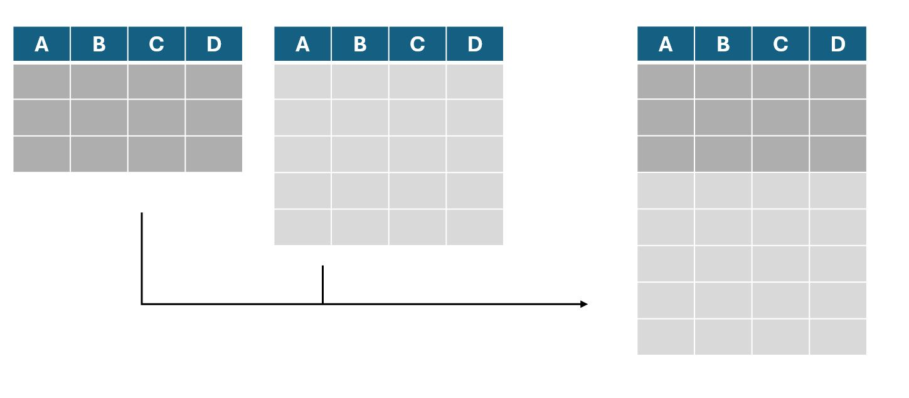
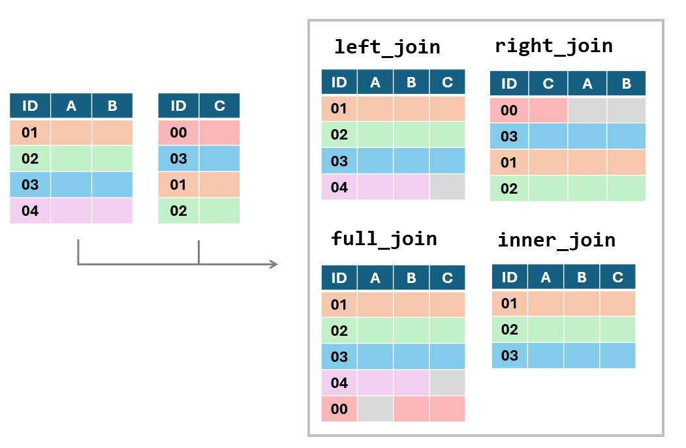

```{=html}
<style>
h1, h2, h3, h4, h5, h6 {
  direction: rtl;
}
p {
  direction: rtl;
}

.text-block1 {
  direction: rtl;       /* Set text direction to right-to-left */
  text-align: right;
  background-color: #e7f3fe; /* Light grey background */
  padding: 10px;
  border-radius: 5px;
  border: 1px solid #ddd; /* Light border */
  margin: 10px 0; /* Space around the block */
}

</style>
```
<!-- tutorial options and cheching options - TODO set params -->

```{r setup, include=FALSE}
library(learnr)
library(gradethis)
library(Rcourse)
library(dplyr)
library(tidyr)

filter = dplyr::filter

tutorial_options(
  exercise.timelimit = 60,
)

gradethis::gradethis_setup()
knitr::opts_chunk$set(error = TRUE, warning = FALSE) 
```


```{r prepare-rbind}

df_full = data.frame(subject_id = 1:6,
                              age = c(24,26,29,19,41,35),
                     eye_color = c("blue","brown","green","brown","blue","brown"),
                             stylish_socks = c(TRUE,TRUE,FALSE,FALSE,TRUE,FALSE))

# row bind

df_partial1 = df_full[1:4,]
df_partial2 = df_full[5:6,]

# column bind

df_first_columns = df_full[1:4,][1:2]
df_last_columns = df_full[1:4,][3:4]
  
```

```{r prepare-table2}
table2 = need_for_cognition %>%
  mutate(nfc_02 = 6 - nfc_02r,  # נהפוך את הקידוד של שלושת העמודות ההפוכות
         nfc_03 = 6 - nfc_03r,
         nfc_06 = 6 - nfc_06r,
         # נחשב את ממוצע ששת השאלות.
         # שימו לב - אפשר להשתמש בעמודות שיצרנו מוקדם יותר בתוך הפונקציה
         nfc    = (nfc_01 + nfc_02 + nfc_03 + nfc_04 + nfc_05 + nfc_06)/6
         )
```

```{r prepare-join}
set.seed(111)
results = data.frame(subject = rep(1:3,each = 3),
                     trial = rep(1:3,3),
                     score = rnorm(9,70,20) %>% round())

trial_data = data.frame(subject = rep(1:4,each = 3),
                     trial = rep(1:3,4),
                     condition = c("easy","hard","medium","medium","easy","hard","hard","easy","medium","hard","medium","easy"))

```


```{r prepare-mood}
set.seed(111)
mood_scores = rep(runif(20,2,8), each = 3) + rnorm(60,0,2) + rep(c(-0.5,0,0.5),20)
mood = data.frame(subject = rep(1:20, each = 3),
                                 measurement_time = rep(c("T1","T2","T3"),20),
                                 mood_score = ifelse(mood_scores>10,10,
                                                      ifelse(mood_scores<0,0,mood_scores)) %>% round() )
```


##  מבוא

ביחידה זה נלמד להשתמש במגוון פונקציות המאוגדות תחת החבילות `dplyr` ו`tidyr`.

פונקציות אלו מאוד נפוצות בשימוש בR כיוון שהן מאפשרות לעבד קבצי נתונים
באופן פשוט ומסודר. בחלק מהמקרים הפונקציות שנפגוש יאפשרו לנו לעשות דברים
שכבר למדנו איך לעשות בשיעורים הקודמים (משל - חיתוך של שורות או עמודות
מתוך טבלה) אך הן יעשו זאת באופן שיאפשר לנו לשמור את הקוד שלנו קריא
ותמציתי. במקרים אחרים נפגוש פונקציות שמאפשרות לנו לעשות עיבודים חדשים
שעוד לא פגשנו.

השיעור ארוך יותר מהשיעורים הקודמים, אך הוא נוגע בתחומים מרכזיים מאוד בניתוח נתונים ולכן מומלץ להקדיש לו זמן וקשב.


### פקד ההעברה

לפני שנגיע לשימוש בפונקציות עצמן, נרצה להתעכב על פקד חדש הנכלל ב`dplyr`: פקד ההעברה (או באנגלית - piping). פקד זה מיוצג על ידי הסימון `%>%`
ואפשר לחשוב עליו כעל צינור שמעביר את האובייקט שלפניו לפונקציה שמופיעה אחריו.

למשל, במקום לכתוב `mean(vector1)` נוכל לכתוב `vector1 %>% mean()`. הפקד יקח את הוקטור `vector1` ויעביר אותו אל תוך הפונקציה `mean`.

לפניכם מספר דוגמאות. בכל דוגמה - שתי השורות מבצעות את אותה הפעולה בדיוק.

```{r}
# וקטור הציונים
scores = c(80.2,75.5,60,75.5,75.5,75.5,84,80.2,94)

# סינון כפילויות
unique_scores = unique(scores)
print(unique_scores)
unique_scores = scores %>% unique()
print(unique_scores)

# עיגול הציונים
rounded_scores = round(scores, digits = 0)
print(rounded_scores)
rounded_scores = scores %>% round(digits = 0)
print(rounded_scores)
```

#### למה זה טוב?

כל עוד אנחנו משתמשים בפונקציה אחת, אין לשימוש בפקד זה יתרון משמעותי.
היתרון העיקרי מגיע כשאנחנו רוצים להשתמש בכמה פונקציות ברצף. במקרים כאלו,
אנחנו יכולים להכניס את התוצר של כל פונקציה בתוך הפונקיה הבאה, אבל כתיב
כזה ייצר קוד מאוד מסורבל. הפקד מאפשר לנו לכתוב את אותו הקוד באופן יותר מסודר ונח לקריאה. נוכל גם לרווח את הקוד לשורות שונות ולהוסיף הערות
שיעזרו לנו לזכור מה עושה כל שלב בניתוח.

למשל - נוכל להשתמש בפקד ההעברה כדי לחשב את **מספר** הערכים הייחודיים בוקטור הציונים שלנו:

```{r}
# וקטור הציונים
scores = c(80.2,75.5,60,75.5,75.5,75.5,84,80.2,94)

## ללא פקד העברה
n_unique_scores = length(unique(scores))

## עם פקד העברה
n_unique_scores = scores %>%
  unique() %>%  # מסננים כפילויות
  length()      # ואז מחשבים את אורך הוקטור שקיבלנו 
```


**שימו לב** - כשאנחנו משתמשים בפקדי העברה, תוצרי הביניים של הפונקציות לא
נשמרים. התוצר היחיד שישמר הוא התוצר של הפונקצייה האחרונה בשרשרת, והוא
יישמר תחת שם האובייקט שאליו ביצענו את ההשמה.


כדוגמה נוספת, נדפיס את ממוצע שורשי הציונים.

```{r}
# וקטור הציונים
scores = c(80.2,75.5,60,75.5,75.5,75.5,84,80.2,94)

# ללא פקד ההעברה
print(round(mean(sqrt(scores)),digits = 1))

# עם פקד ההעברה
scores %>%
  sqrt()%>%                # חישוב שורשי הציונים
  mean()%>%                # חישוב הערך הממוצע מתוך שורשי הציונים
  round(digits = 1) %>%    # עיגול הממוצע שחושב לספרה אחת אחרי הנקודה העשרונית
  print()                  # הדפסה

```


בדוגמה הזו היתרון של כתיבה באמצעות פקדי העברה נהיה קצת יותר ברור. במהלך השיעור נראה דוגמאות נוספות ליתרון של שימוש בפקד זה.
  


`תרגיל` כתבו מחדש את הקוד הבא באמצעות פקד העברה:


```{r} 
numbers_as_text = c("12","14","15","7","34","22","17")
mean_number = round(mean(as.numeric(numbers_as_text)),digits = 2)
print(mean_number)
```


```{r exercise1_5_piping,exercise=TRUE, exercise.eval = FALSE}

numbers_as_text = c("12","14","15","7","34","22","17")

mean_number =  
  
print(mean_number)

```

```{r exercise1_5_piping-solution}

numbers_as_text = c("12","14","15","7","34","22","17")

mean_number = numbers_as_text %>%
  as.numeric() %>%
  mean() %>%
  round(digits = 2)

print(mean_number)

```

```{r exercise1_5_piping-check}
grade_this_code()
```


## בחירת עמודות

הפונקציות הראשונות בהן נשתמש מבצעות פעולות שכבר התנסנו בהן.

למשל, הפונקציה `select` מאפשרת לנו לייצר טבלה חדשה מתוך העמודות של טבלה קיימת. אנחנו יכולים לציין את שמות העמודות
שאנחנו רוצים **להשאיר**, או את אלו שאנחנו רוצים
לסלק (בליווי סימן מינוס).

::: text-block1
כך או כך, הפונקציה מייצרת טבלה **חדשה** מתוך החיתוך שעשינו. 
היא לא עורכת את הטבלה המקורית שהכנסנו לפונקציה, אלא מייצרת העתק חדש ומבצעת את הסינון עליו.

במידה ואנחנו רוצים לערוך את אותה הטבלה אנחנו יכולים לשמור את ההעתק המעודכן תחת שמה של הטבלה המקורית ובכך לדרוס את הגרסה הישנה ולהחליף אותה
במעודכנת.
:::

הנה כמה דוגמאות:

```{r}

# נשתמש בטבלה שייבאנו בשיעור הקודם, המכילה את נתוני שאלון 
# need for cognition

# בחירת העמודות המציינות את מספר ההרצה, את מין הנבדק ואת הגיל שלו
demographic_data = need_for_cognition %>% 
  select(session_id,age,gender)

head(demographic_data,3)

# השמטת העמודה הראשונה ועמודות בדיקת תשומת הלב
no_attention_check = need_for_cognition %>%
  select(-1,-attention_check)

head(no_attention_check,3)

# עדכון הטבלה שיצרנו כך שלא תכיל את נתוני הגיל
no_attention_check = no_attention_check %>% 
  select(-age) 

head(no_attention_check,3)

```


```{r q1_5, echo = FALSE}
question("<div style='direction: rtl;'>אם היינו מריצים את קטע הקוד האחרון (עדכון הטבלה שיצרנו כך שלא תכיל את נתוני הגיל) פעמיים ברציפות - היינו מקבלים הודעת שגיאה. מדוע?</div>",
         
         answer("כיוון שאי אפשר להריץ את אותו הקוד פעמיים"),
         answer("כיוון שהטבלה בה אנו משתמשים כבר לא קיימת"),
         answer("כיוון שהטבלה גדולה מדי"),
         answer("כיוון שאנחנו מנסים להסיר מהטבלה עמודה שכבר לא קיימת בה", correct = TRUE),
         allow_retry = TRUE
)
```

`תרגיל` חתכו מתוך הטבלה רק את מספרי ההרצה (session_id) ואת תוצאות מבחן תשומת הלב (attention_check)

```{r exercise2_5_select, exercise=TRUE, exercise.eval = FALSE }

session_and_attention = ______________

print(session_and_attention)
```

```{r exercise2_5_select-check}
grade_result(
  pass_if(~identical(.result,
                     session_and_attention %>% 
                       select(session_id, attention_check)))
)
```


### בחירת עמודות המכילות תווים מסוימים

יישום שימושי נוסף של פונקציה זו הוא שהיא מאפשרת לבחור עמודות על סמך
התוכן של שמות העמודות. לדוגמה, באמצעות שימוש בפונקציה `contains` בתוך פונקציית ה`select` נוכל לבחור את
כל העמודות המכילות רצף תווים מסוים. אפשרות זו שימושית כשאנחנו רוצים
לבחור קבוצה של עמודות ששמרנו בשם דומה - למשל תשובות לשאלות שונות באותו
השאלון.

בדוגמה למטה אנחנו חותכים מתוך הטבלה הכללית שלנו תת-טבלה המכילה רק את
התשובות לשאלון ואת המספר המזהה של ההרצה (שמתפקד כמספר מזהה לנבדק).

```{r}

questions_and_sesion_id = need_for_cognition %>%
  select(session_id,contains("nfc"))

head(questions_and_sesion_id,3)
                
```


### שליפת עמודה כוקטור

שימו לב - כשנבצע בחירת עמודות באמצעות `select` נקבל חזרה טבלה - גם אם
בחרנו רק עמודה אחת. 

במידה ונרצה לבצע חיתוך של עמודה בודדת **כוקטור** ולא
כטבלה נוכל להיעזר בפקד ה\$, או להשתמש בפקודה `pull` המבצעת פעולה דומה.
בדוגמה הבאה אנו נעזרים בפונקציה זו על מנת לבחון מה הם הערכים השונים
המוכלים בעמודה gender.


```{r}

need_for_cognition %>% pull(gender) %>% # שליפת העמודה המכילה את נתוני המגדר
  unique() %>%              # פונקציה המשיבה וקטור שמונה את הערכים השונים הקיימים בוקטור
  print()                   # הדפסה

```

ניתן לראות שהעמודה מכילה ערכים המעידים על נבדקים זכרים, נקבות וערכים חסרים כלשהם (NA).


## סינון שורות

עכשיו שבררנו את העמודות הנחוצות לנו - נוכל לעבור לעיסוק המשלים: סינון שורות.

גם כאן נוכל לשמור או להשמיט שורות לפי המספר הסידורי שלהן, באמצעות הפקודה
`slice` , אך ברוב המקרים סינון השורות שנרצה לבצע יהיה תלוי בתוכן של
השורות עצמן ולא במספר הסידורי.

למשל - ייתכן ונרצה לסנן מתוך קובץ הנתונים שלנו את כל הנבדקים שלא סיימו
את הניסוי, הנבדקים שנמצאים מחוץ לטווח גילאים מסויים או שחסרים להם נתונים
חשובים.

בשביל פעולות כאלו, שהינן תנאי הכרחי כמעט בכל ניתוח שנערוך, ניעזר
בפונקציה `filter`.

פונקצייה זו מקבלת את הטבלה עליה נרצה לבצע את הסינון (באופן ישיר או
באמצעות פקד ההעברה), ותנאי לוגי שיקבע אילו שורות **ישארו**. תנאי זה יתבסס על
עמודה אחת או יותר מתוך הטבלה.

נמחיש באמצעות מספר דוגמאות:

```{r}
library(dplyr)
# שמירת כל הנבדקים שעמדו בבדיקת תשומת הלב בניסוי

filtered_table1 = need_for_cognition %>%
  filter(attention_check == 1) 

# שמירת כל הנבדקים בין גילאי 20 ו30 (כולל)

filtered_table2 = need_for_cognition %>%
  filter(age >= 20 & age <=30) 

 # שמירת הנבדקים הגברים בלבד (סינון נשים וערכים חסרים)

filtered_table3 = need_for_cognition %>% 
  filter(gender == "male") 

# שליפת הנתונים של 3 נבדקים ספציפיים, על פי מספר מזהה

filtered_table4 = need_for_cognition %>% 
  filter(session_id %in% c(7392233, 7392875 , 7397497))

```


שימו לב שבדוגמה השנייה השתמשנו במספר תנאים לוגיים ששולבו יחד. כשנרצה לבצע סינונים מורכבים נוכל לצרף כמה וכמה תנאים לכדי פעולה לוגית שתשאיר רק את השורות שאנחנו מעוניינים בהן.


למשל, בקטע הבא אנחנו שומרים רק נבדקים שעומדים לפחות באחד משני התנאים:

**1)** נשים שעברו את מבחני הקשב

**2)** גברים - בין אם עברו את מבחני הקשב או לא


```{r}
filtered_table = need_for_cognition 

```


`תרגיל` : סננו את הקובץ כך שיכיל רק תצפיות של גברים מעל
גיל 25 ונשים מעל גיל 30

```{r exercise3_5_filter, exercise=TRUE, exercise.eval = FALSE,}
# גברים מעל גיל 25 ונשים מעל גיל 30 
female_or_male_by_age = need_for_cognition %>%
    filter(___________)
             
```

```{r exercise3_5_filter-check}
grade_result(
  pass_if(~identical(.result, need_for_cognition %>%
    filter((gender == "male" & age>25)|(gender=="female" & age >30))))
)

```


### ערכים חסרים

בעבודה עם נתוניים אמיתיים במקרים רבים אנחנו נתקל
בנתונים חסרים. החוסר יכול לנבוע מכך שנבדק פספס שאלה מסוימת, נפסל באחד
הסבבים של מטלה, או שהייתה בעיה כלשהי בשמירת הנתונים שלו.

כפי שראינו קודם, הנתונים החסרים יסומנו באמצעות הסימן NA.


יש כמה דרכים בהם נוכל להתמודד איתם:

::: text-block1

 **1) להשאיר אותם כפי שהם:** במידה ומדובר בנתון שאינו חיוני לרוב הניתוחים שלנו ייתכן ונרצה לשמור את התצפית ולהשאיר את הערכים החסרים כפי שהם. במידה ובוחרים באפשרות זו נצטרך לוודא שאנחנו מתעלמים מהנתונים החסרים בניתוחים הרלוונטיים.
 
 **2) לסנן את השורות הבעייתיות:** במקרים בהם הנתון החסר חשוב או מעיד על בעיה בנתונים ייתכן ונרצה לסנן את התצפיות המכילות ערכים שכאלו. במקרים מסויימים הדבר יוביל לפסילה ומחיקה של כל הנתונים של אותו הנבדק.
 
 **3) להחליף אותם בערכים אחרים:** אפשרות זו תשמש אותנו בעיקר כשהערכים החסרים נובעים מהאופן בו ניהלנו את המידע שלנו ואנחנו יודעים באילו ערכים נרצה להחליף אותם.

:::
 
### סינון ערכים חסרים

במידה ונבחר למחוק את השורות המכילות ערכים חסרים, נוכל לעשות זאת באמצעות הפונקציה `drop_na`.

להלן מספר דוגמאות:

```{r e8}

nrow(need_for_cognition) # מספר התצפיות בטבלה המקורית

# פונקציה זו מקבלת את שמות העמודות שעל בסיסן נרצה להשמיט את הנתונים.
# בדוגמה זו השמטנו שורות  בהן הערך בעמודת המגדר היה חסר
table1 =  need_for_cognition %>% drop_na(gender)
nrow(table1) # מספר התצפיותאחרי סינון ערכים חסרים

# באותו האופן, ניתן להשמיט שורות שיש בהן ערך חסר *בעמודה אחת לפחות* מתוך העמודות שציינו
table2 =  need_for_cognition %>% drop_na(gender, nfc_01, nfc_02r, nfc_03r)
nrow(table2) # מספר התצפיותאחרי סינון ערכים חסרים

# או להשמיט שורות שיש בהן תצפית חסרה כלשהי, בעמודה כלשהי
table3 = need_for_cognition %>% drop_na()
nrow(table3) # מספר התצפיותאחרי סינון ערכים חסרים

```


`תרגיל:` סננו מתוך הטבלה את כל התצפיות המכילות ערך חסר באחת השאלות של השאלון


```{r ex_drop_na, exercise = TRUE, exercise.eval = FALSE}


filtered_table =  ______________


print(paste("Filtered", nrow(need_for_cognition) - nrow(filtered_table),"rows"))
```


```{r q2_5, echo = FALSE}

question_text(
  "<div style='direction: rtl;'>כמה תצפיות סיננתם?</div>",
  answer("66", correct = TRUE),
  allow_retry = TRUE
)

```

### החלפת ערכים חסרים

במידה והחלטנו להחליף את הערכים החסרים נצטרך לבחור אחת משתי שיטות:

להחליף את הערכים החסרים בערך קבוע כלשהו או
ל"מלא" את הערכים החסרים בערכים מהשורה מעל או מתחת לערך החסר.

בקובץ שלנו ישנם ערכים חסרים בעמודת המגדר. ייתכן ואלו נובעים ממקרים בהם הנבדק בחר שלא למלא את השאלה הרלוונטית. במידה וזה המצב - נוכל להחליף את הערכים החסרים בערך שמבטא את זה שאותם נבדקים בחרו שלא לשתף את המגדר שלהם.

ההחלפה מתבצעת באמצעות הפונקציה `replace_na` השייכת לחבילה `tidyr`.

```{r}
library(tidyr)
table2 = need_for_cognition %>% replace_na(list(gender= "Prefered not to say"))
```


מילוי ערכים על סמך ערכים שהגיעו לפני או אחרי הערך החסר היא פרקטיקה שנמצאת בשימוש רק במצבים בהם הנתונים שלנו נוצרו באופן שיצדיק זאת. למשל - ייתכן והנתונים שלנו מכילים מספר תצפיות שונות מכל שלב של מטלה ממוחשבת, אבל הגירוי שהוצג באותו שלב של המטלה מצויין רק בשורה הראשונה של כל סבב. במקרים כאלו ייתכן ונרצה להחליף את הערכים החסרים של שאר התצפיות בסבב בערך הראשון שמופיע לפניהם. הפונקציה שתשמש אותנו לשם כך נקראת `fill` והיא יודעת להשלים את הערכים לפי הערך הקודמים שהופיעו (כלפי "מטה") או לפי הערך התקף הבא (כלפי "מעלה").

בדוגמה הבאה נמלא את הערכים החסרים בעמודת הגירוי (stimulus) על פי הערך הקודם שהופיע בעמודה:

```{r}

df = data.frame(round      = rep(1:2, each = 4), # נייצר נתונים ל2 סבבים, כשכל סבב מכיל 4 תגובות
                response_i = rep(1:4,2), #נחזור פעמיים על הרצץ 1 עד 4 כדי לייצר את מספר התגובה עבור כל סבב 
                stimulus   = c("Img1",NA,NA,NA,"Img2",NA,NA,NA) )

print(df)

filled_df = df %>% fill(stimulus, .direction = "down")

print(filled_df)
```


### ערכים כפולים

לעיתים, במיוחד כשאנחנו עוסקים במידע שצורף ממספר מקורות שונים, הטבלאות שלנו
עלולות להכיל כפל של נתונים. ייתכן, למשל, ששילבנו יחד שני קבצים שבשניהם
הופיעה אותה תצפית ולכן היא תופיעה לנו פעמיים בקובץ המאוחד. לטובת מקרים כאלו קיימת הפקודה `distinct`, שתפקידה
לסנן תצפיות כפולות. הפונקציה תקח את הטבלה שלנו, תעבור על כל השורות ותמחק
שורות שמופיעות יותר מפעם אחת.


לפניכם מספר דוגמאות:

```{r e10}
# בקובץ המקורי אין כפילויות, ולכן נייצר טבלה עם מספר כפילויות לצורך ההדגמה
table1 = need_for_cognition[c(1:1000,36,207,6),] # נחתוך את אלף השורות הראשונות + חזרה כפולה על מספר שורות

nrow(table1) # מספר השורות לפני מחיקת כפילויות

table2 = table1 %>%
  distinct()

nrow(table2) # מספר השורות אחרי מחיקת כפילויות
```


## שינוי שמות וסידור לפי ערכים

#### rename

חבילת dplyr מספקת לנו גם דרך פשוטה לשנות את שמות העמודות שלנו. כמו כל
הפונקציות הקודמות שפגשנו, גם כאן הפונקציה *אינה עורכת* את הטבלה המקורית,
אלא מייצרת עותק ערוך שלה אותו נצטרך לשמור. הפונקציה מקבלת פירוט של השמות
החדשים שנרצה לתת לעמודות בליווי שמן הנוכחי.

```{r e11}
names(need_for_cognition)

table1 = need_for_cognition %>%
  rename(subject  = session_id,
         sex = gender)
        #new_name = old_name

names(table1)
```

#### Arrange

פונקציה נוספת העשויה לעזור לנו בסידור הנתונים שלנו היא הפונקציה arrange.
פונקציה זו תחזיר לנו את הטבלה כשהיא מסודרת בסדר עולה או יורד על פי הערכים עמודה
אחת או יותר. הפונקציה תסדר עמודות מספריות לפי סדר הערכים ועמודות המכילות
תווים לפי סדר הא' ב'.

במידה ונרצה להפוך את סדר המדרג נוכל להכניס את העמודה לפיה אנו מעוניינים לסדר את הטבלה לתוך הפונקציה `desc`, כפי שמופיע באחת הדוגמאות הבאות:

```{r e12}

table1 = need_for_cognition %>%
  arrange(age)    # סידור לפי גיל

head(table1)

table2 = need_for_cognition%>%
  arrange(desc(session_id))  # סידור לפי מספר הרצה, בסדר יורד

head(table2)

table3 = need_for_cognition %>% 
  arrange(gender, age)  # סידור לפי מגדר - ואז לפי גיל

head(table3)
```


## עריכת נתונים

הפעולות העיקריות שנעשה בניתוח נתונים כוללות עריכה של הנתונים עצמם. כדי
שנוכל לערוך את המבחנים הסטטיסטיים שמעניינים אותנו או לייצר תרשימים
רלוונטיים נצטרך להפיק מהנתונים הגולמיים שלנו מדדים, ,לסכם אותם ולחבר
אותם עם נתונים נוספים.

בפרק הנוכחי נעבור על הפעולות הבסיסיות שנדרשות מאיתנו כחלק מתהליך זה

### חישוב עמודות - mutate

הפונקציה הנפוצה ביותר בתהליך עיבוד הנתונים היא הפונקציה mutate. פונקציה
זו מאפשרת לנו להגדיר עמודות חדשות או לערוך עמודות קיימות - באופן דומה
לעריכה שעשינו באמצעות פקד ה\$. בשילוב עם מספר פונקציות בסיסיות, פונקציית
הmutate מאפשרת לנו לערוך אתהעמודות שבטבלה שלנו במגוון רחב של דרכים.
הפונקציה מאפשרת לנו לערוך מספר עמודות בבת אחת, כאשר החישוב של כל עמודה
מופרד בפסיק ממשנהו.

להלן מספר דוגמאות:

```{r e13}

mutated_table = need_for_cognition %>%
  mutate(nfc_02 = 6 - nfc_02r,  # נהפוך את הקידוד של שלושת העמודות ההפוכות
         nfc_03 = 6 - nfc_03r,
         nfc_06 = 6 - nfc_06r,
         # נחשב את ממוצע ששת השאלות.
         # שימו לב - אפשר להשתמש בעמודות שיצרנו מוקדם יותר בתוך אותה הפונקציה
         nfc    = (nfc_01 + nfc_02 + nfc_03 + nfc_04 + nfc_05 + nfc_06)/6
         )
# שימו לב לסוגריים - כל העמודות שיצרנו בוכנסו בתוך פונקצייה אחת, בה הפרדנו את ההתייחסות לכל עמודה בפסיקים.
# ירידת השורה בין עמודה לעמודה נועדה כדי לשמור על הסדר ואינה נדרשת בשביל תקינות הקוד

print(mutated_table)

```

דרך פונקציה זו נוכל גם לעדכן את סוג העמודות (מספרי / תווים / ערכים לוגיים / פקטור), לחלק 

```{r e14, exercise=TRUE, exercise.eval = FALSE, exercise.setup = "prepare-table2"}

table3 = need_for_cognition %>% 
  mutate(gender_factor = factor(gender),             # יצרנו גרסת פקטור של נתוני המגדר
         gender_numeric = as.numeric(gender_factor), # יצרנו עמודה מספרית על סמך העמודה הקודמת (תכיל 0 ו1)
         
         age_above_18 = age >=18,  # האם הנבדק מעל גיל 18
         
         age_above_25 = ifelse(age < 25, # פונקציה נוספת המאפשרת לקבוע ערכים בהתאם לתנאי
                                "under 25", # הערך עבור תצפיות בהם התנאי מתקיים
                                "25 or older") # הערך עבור תצפיות בהן התנאי לא מתקיים
 
        gender = ifelse(gender == "female", # שימוש נוסף בפונקציה כדי לקודד מחדש ערכים
                        "F", # שינינו את הקידוד של נשים
                        ifelse(gender == "male", "M", # בתצפיות שאינן של נשים - שינונו את הקידוד של גברים
                               "Prefered not to say")) # ואת הקידוד של מי שהערך שלו אינו אף אחד מהשניים הנ"ל
                                                       # (ערכים חסרים או אחרים)
```


## סיכום נתונים

לאחר שסידרנו וערכנו את הנתונים שלנו, נרצה לסכם אותם. בשיעורים הקודמים ראינו איך מסכמים נתונים מווקטור, למשל - על ידי חישוב הממוצע או סטיית התקן של הערכים המופיעים בו, וברמת העיקרון יכולנו לחתוך מתוך הטבלה את הנתונים של כל קבוצה ולסכם אותם בנפרד.

למזלנו, ישנה דרך פשוטה יותר לסכם את הנתונים של כל הקבוצות (ותתי הקבוצות) בטבלה שלנו - באמצעות הפונקציות `group_by` ו`summarise`.

הפונקציה הראשונה מביניהם תשמש אותנו כדי לחלק את הטבלה לקבוצות, לפי הערכים המופיעים באחת העמודות. למשל - אם אנחנו רוצים לסכם את הנתונים בטבלה `df1`בנפרד עבור נשים וגברים, נוכל להשתמש בשורת הקוד `df1_grouped = df1 %>% group_by(gender)`. 

הטבלה שנקבל תהיה זהה לטבלה המקורית שלנו - אבל כל פעולה שנבצע עליה תתבצע לפי קבוצות. לכן - כשנעביר אותה לפונקציה `summarise`, המדדים שנחשב יחושבו בנפרד לכל קבוצה.

נמחיש באמצעות דוגמה:

```{r summary11, exercise=TRUE, exercise.eval = FALSE, , exercise.setup = "prepare-table2"}

summary_table = table2 %>% 
  group_by(gender)%>%
  summarise(mean_nfc = mean(nfc, na.rm = T),# חישוב ממוצע המדד עבור כל קבוצה
            sd_nfc   = sd(nfc,na.rm = T),   # חישוב סטיית התקן עבור כל קבוצה
            n_total = n(),                  # ספירת כמות התצפיות בכל קבוצה
            n_valid = sum(!is.na(nfc)),  # ספירת התצפיות שאינן חסרות
            n_na = sum(is.na(nfc))          # ספירת התצפיות החסרות
  )

print(summary_table)
```

בדוגמה זו, אנחנו מסכמים את מדד nfc, שחישבנו לכל נבדק בדוגמאות הקודמות. אנחנו קודם כל מקבצים את הטבלה לפי קבוצות מגדר ואז מחשבים עבור כל קבוצה את הממוצע של מדד זה, את סטיית התקן, את כמות התצפיות ואת הכמות מתוכן שערך מדד הnfc חסר בהן.


כפי שניתן לראות בדוגמה, הפלט של הפונקציה הוא טבלה, המכילה עמודה אחת לכל מדד שחישבנו בפונקציה `summarise`, בנוסף לעמודה המציינת לאיזו קבוצה כל שורה בטבלה מתייחסת.


שימו לב - מאחר ועמודת המגדר שלנו מכילה ערכים חסרים, התוכנה התייחסה אליהם
כאל קבוצה נוספת וחישבה את מדדי הסיכום גם עבורם.


```{r q3_5, echo = FALSE}
question_text(
  "<div style='direction: rtl;'> מה היה ממוצע מדד nfc אצל הנשים במדגם? </div>",
         answer("3.15", correct = TRUE),
         allow_retry = TRUE
)
```

```{r q4_5, echo = FALSE}
question_text(
  "<div style='direction: rtl;'> כמה תצפיות חסרות היו במדד הnfc אצל גברים? </div>",
         answer("14", correct = TRUE),
         allow_retry = TRUE
)
```

```{r q5_5, echo = FALSE}
question_text(
  "<div style='direction: rtl;'> כמה נבדקים יש בקובץ שערך המגדר שלהם חסר, אבל הציון שלהם במדד nfc תקין? </div>",
         answer("23", correct = TRUE),
         allow_retry = TRUE
)

```

בדוגמה הקודמת סיכמנו על סמך עמודה אחת בלבד. במידה ונרצה לייצר תתי
קבוצות ממספר עמודות (למשל - גברים מבוגרים, גברים צעירים, נשים מבוגרות
ונשים צעירות), נוכל להכניס עמודות נוספת לפונקציית ה`group_by`.


`תרגיל:` השלימו את הקוד הבא בהתאם להערות.

```{r summary2, exercise=TRUE, exercise.eval = FALSE, , exercise.setup = "prepare-table2"}

summary_table2 = table2 %>% 
  # נייצר עמודה נוספת המבחינה בין נבדקים מעל ומתחת לגיל 30
  mutate(over_30 = ifelse(age >30,"over 30","30 or under")) %>%
  group_by(gender, over_30)%>%
  summarise(n_observations =                , #  (כולל ערכים חסרים)מספר התצפיות  הכולל בתת הקבוצה
            mean_nfc =                      , #  ממוצע ציון המדד, תוך התעלמות מערכים חסרים
            percent_attention_valid =         # אחוז הנבדקים שעברו את מבחן הקשב (מקודד כ1))
  )

print(summary_table2)
```


## צירוף נתונים

הנושא הבא שנתעסק בו כולל צירוף של נתונים מכמה טבלאות שונות. לא נדיר
שבמחקר בפסיכולוגיה אנחנו נדרשים לצרף יחד נתונים מכמה מקורות. למשל -
ייתכן ונריץ ניסוי שבו הנבדקים משתתפים במטלה קוגנטיבית כלשהי ובסופה
ממלאים מספר שאלונים. בניתוח של נתונים כאלו נרצה להפיק לכל נבדק ציונים
במדדים שונים על בסיס תשובותיהם בשאלונים ולחבר אותן יחד עם מדדים הקשורים
בביצועים שלהם במטלה. דוגמה נוספת היא מצב בו יש לנו נתונים מאותו המחקר
בכמה קבצים שונים, כיוון שהוא נערך על ידי כמה מעבדות / בכמה עמדות שונות.

ישנם כמה צורות שונות בהן נוכל לחבר את קבצי הנתונים שלנו:

  **1)**  צירוף "טיפש", לפי שורות או עמודות

  **2)**  הצלבת תצפיות


### צירוף "טיפש"

במידה ויש לנו 2 טבלאות עם אותן עמודות, אך עם תצפיות שונות - נוכל לאחד את
השורות מהטבלאות השונות לכדי טבלה אחת ארוכה. אפשר לחשוב על פעולה זו כאל
הדבקה של השורות מטבלה אחת בסופה של הטבלה השנייה.

{width="500"}

הפונקצייה שתשמש אותנו לשם כך נקראת `bind_rows`.

להלן דוגמה:

```{r e115, exercise=TRUE, exercise.eval = FALSE, exercise.setup = "prepare-rbind"}

print(df_partial1)
print(df_partial2)


full_df =  bind_rows(df_partial1, df_partial2)

print(full_df)

```

במידה וישנן עמודות שקיימות רק באחת מהטבלאות, הפונקצייה תמלא את עמודה זו בערכים חסרים עבור כל התצפיות של הטבלה השנייה


```{r e116, exercise=TRUE, exercise.eval = FALSE, exercise.setup = "prepare-rbind"}
# נוסיף עמודה נוספת לטבלה הראשונה
df_partial1_with_extra_column = df_partial1 %>% mutate(dancing_abilities = c( "Average","Poor", "Average", "Good"))


# הוספנו עמודה נוספת לאחת הטבלאות, שלא קיימת בטבלה השנייה
full_df_with_na = bind_rows(df_partial1_with_extra_column, 
                            df_partial2)

print(full_df_with_na)

```


### צירוף עמודות


באופן דומה - ניתן גם לצרף עמודות מטבלאות שונות. הפעם נצטרך שהטבלאות יהיו
באותו האורך, והצירוף שלהן "ידביק" אותן זו לצד זו.

{width="500"}

```{r e16, exercise=TRUE, exercise.eval = FALSE , exercise.setup = "prepare-rbind"}

print(df_first_columns)
print(df_last_columns)

full_df =  bind_cols(df_first_columns, df_last_columns)

print(full_df)
```

### הצלבת תצפיות

צירוף שורות או עמודות הוא צירוף "טיפש", כלומר - הוא לא לוקח בחשבון את
התוכן של הטבלאות. הוא גם מתבסס על ההנחה שהטבלאות מסודרות באופן זהה, כך
שהדבקה פשוטה שלהן זו לצד זו, או זו אחרי זו, תייצר טבלה קוהרנטית.

במקרים רבים נרצה להצליב ולצרף נתונים מטבלאות שאינן בהכרח בעלות מבנה זהה.
ציינו דוגמה שכזו בתחילת הפרק - הצלבה של נתוני שאלונים עם תוצאות במטלה.
בשביל צירוף כזה אנחנו נצטרך לצרף את הנתונים על סמך סימן מזהה כלשהו -
למשל, על סמך מספר נבדק. אנחנו נרצה שהתוכנה תעבור על שתי הטבלאות, תמצא תצפיות
בעלות אותו מספר נבדק ותשלב אותן יחד.

למעשה, יש כמה דרכים שבהן אפשר לבצע את הפעולה הזו.


האפשרויות שלנו הן:


::: text-block1

  **1)**  להשאיר טבלה אחת כפי שהיא, ולצרף אליה את התצפיות המתאימות מהטבלה
    השנייה. כדי לבצע חיבור שכזה נשתמש בפונקציות `left join` או `right_join`.


  **2)**  להשאיר את כל התצפיות משתי הטבלאות ולמלא את הטבלה בערכים חסרים בשורות
    בהן אין התאמה בין הטבלאות. פעולה זו שומרת על כל התצפיות משתי הטבלאות ומתבצעת באמצעות הפונקציה `full_join`


  **3)**  לשמור אך ורק את התצפיות שנמצאות בשתי הטבלאות. במקרה הזה אנחנו לא נוסיף ערכים חסרים לטבלה, אבל נשמיט את כל התצפיות שנמצאות רק בטבלה אחת מתוך השתיים. הפוהקציה `inner_join` מבצעת את פעולה זו. 

:::


{width="500"}


הדגמה:

נייצר 2 טבלאות עם נתונים פיקטיביים, המכילים ציונים במטלה ומידע דמוגרפי אודות הנבדקים.

```{r}

# נייצר נתונים פיקטיביים

df1 = data.frame(subject_id = c(1:5),
                 age = c(22,25,20,31,40),
                 gender = c("M","F","F","M","F"))

df2 = data.frame(subject_id = c(3,2,4,6,5),
                 task_score = c(120,87,113,94,250))

print(df1)
print(df2)
```


נדגים את סוגי הצירוף השונים:

```{r}
# הוספת תוצאות המטלה מהטבלה השנייה לתצפיות בטבלה הראשונה

left_join(df1, df2, by = "subject_id") %>%
  print()


# הוספת נתוני הגיל והמגדר לתצפיות בטבלה השנייה

right_join(df1, df2, by = "subject_id")%>%
  print()

# שילוב מלא של שתי הטבלאות

full_join(df1, df2, by = "subject_id") %>%
  print()

# הצלבה בין התצפיות המופיעות בשתי הטבלאות והשמטת יתר התצפיות

inner_join(df1, df2, by = "subject_id") %>% 
  print()

```


### צירוף על סמך מספר עמודות

ישנם מקרים בהם נרצה לצרף נתונים על סמך יותר מעמודה אחת. למשל, אם יהיו לנו נתונים על מצב הרוח של נבדקים שונים בימים שונים, ייתכן ונרצה לצרף לטבלה את ההישגים של כל נבדק באותו היום. צירוף כזה ידרוש מאיתנו לצרף את הטבלאות על סמך זהות הנבדק והיום הרלוונטי. 

כדי לבצע צירוף כזה נעביר לפונקציה וקטור של שמות העמודות שעל פיהן נרצה שהצירוף יתבצע. עמודות אלו צריכות להיות קיימות בשתי הטבלאות.

למשל:


```{r}

# נייצר נתונים פיקטיביים

df1 = data.frame(subject_id = c(1,1,1,2,2,2,3,3,3),
                 day        = c(1,2,3,1,2,3,1,2,3),
                 score      = c(2,7,5,6,9,8,1,4,5))

df2 = data.frame(subject_id = c(1,2,3,1,2,3,1,2,3),
                 day        = c(1,1,1,2,2,2,3,3,3),
                 mood       = c(1,7,9,3,4,6,2,7,8))

print(df1)
print(df2)
# שילוב מלא של שתי הטבלאות

df_full = full_join(df1, df2, by = c("subject_id","day"))
print(df_full)

```


::: text-block1
**שימו לב:** כדי שהצירוף יתבצע בהצלחה, כל העמודות שאנחנו מעוניינים לבצע על בסיסן את הצירוף חייבות להיות **ולהיות מאותו הסוג** בשתי הטבלאות.

אם אחת העמודות תוגדר כעמודה מספרית (numeric) בטבלה אחת והמקבילה שלה בטבלה השנייה תוגדר כעמודה המכילה תווים (character), למשל - כשננסה לבצע את הצירוף נקבל הודעת שגיאה.

במקרים כאלו נצטרך להמיר את העמודה באחת הטבלאות לסוג המתאים (כפי שלמדנו בפרק על עריכת נתונים) לפני שנבצע את הצירוף.

:::


`תרגיל:`

הטבלה `results` כוללת את הישגי הנבדקים בסבבים שונים של מטלה ממוחשבת, אך היא אינה מציינת מה היה התנאי בכל סבב (קל / בינוני / קשה). 

הטבלה `trial_data` מכילה את פירוט התנאים בכל סבב עבור כל נבדק - וכוללת גם נבדקים שנפסלו, ולכן אינם כלולים בטבלת התוצאות.

צרפו לטבלה `results` עמודה בשם `condition` שתפרט את התנאי של כל סבב. בצעו את הצירוף כך שלא יתווספו לטבלה שורות ריקות עבור הנבדקים שנפסלו.


```{r exercise4_5_join, exercise=TRUE, exercise.eval = FALSE, exercise.setup = "prepare-join"}

print(results)
print(trial_data)

results_with_condition = ______________________

print(results_with_condition)

```

```{r exercise4_5_join-check}
set.seed(111)
results = data.frame(subject = rep(1:3,each = 3),
                     trial = rep(1:3,3),
                     score = rnorm(9,70,20) %>% round())

trial_data = data.frame(subject = rep(1:4,each = 3),
                     trial = rep(1:3,4),
                     condition = c("easy","hard","medium","medium","easy","hard","hard","easy","medium","hard","medium","easy"))

grade_result(
  pass_if(~identical(.result, 
                     left_join(results, trial_data, by = c("subject","trial"))))
)
```


## שינויי צורה

הנושא האחרון שנעסוק בו בעריכת נתונים הוא שינויים **במבנה** הטבלאות. שינויים אלו לא עורכים את התוכן המיוצג בטבלה, אלא רק את האופן בו הנתונים מסודרים.

מקובל להתייחס לשני פורמטים: פורמט רחב ופורמט ארוך

פורמט רחב מכיל עמודות נפרדות המייצגות ערכים דומים תחת תנאים שונים. כשיש לנו מספר תנאים - יהיו כמה וכמה עמודות, ולכן הטבלה תהיה רחבה. למשל, בטבלה הבאה אנחנו מציגים את התוצאות של ארבעה נבדקים בשני חזרות שונות של אותה המטלה - בפורמט רחב.

```{r}
print(wide_df)
```

העמודות "first" ו"second" מתארות את הישגי הנבדקים בחזרה הראשונה והשנייה של המטלה. אם היינו מוסיפים נתונים מחזרה שלישית, רביעית וכו' הטבלה הייתה הולכת ונהיית רחבה יותר, בהתאם לכך שהוספנו אליה עוד ועוד עמודות.


בפורמט ארוך אותם נתונים יראו כך:

```{r}
print(long_df)
```


כאן יש לנו עמודה אחת המכילה את הערכים (הציון במטלה) ועמודה נוספת המציינת באיזו חזרה מדובר (ראשונה או שנייה). במידה והיינו מוסיפים נתונים מחזרות נוספות - הטבלה הייתה נהיית **ארוכה** יותר.


#### מה עדיף?

ובכן, התשובה תלויה בשימוש שאנחנו רוצים לעשות בנתונים. יהיו מקרים בהם פורמט רחב יהיה לנו יותר נח - למשל אם אנחנו רוצים לחשב את ההפרש בביצועים בין החזרה הראשונה והשנייה של המטלה עבור כל נבדק, ויהיו מקרים בהם דווקא פורמט ארוך יהיה עדיף. 

כפועל יוצא מכך, לא נדיר שאנחנו צריכים להמיר את הטבלאות שלנו מפורמט אחד לפורמט האחר. למזלנו - ישנו צמד פונקציות שמאפשר לנו לעשות זאת בקלות יחסית.


### spread - פורמט ארוך לפורמט רחב

הפונקציות בהן נשתמש נקראות `spread` ו`gather` מהחבילה `tidyr`.


השימוש בפונקציות הוא די פשוט. בנוסף לטבלה עצמה (אותה ניתן להעביר לפונקציה באמצעות פקד העברה) הפונקציות צריכות לקבל מאיתנו :

::: text-block1

  **1)key:**
  שם העמודה המכילה את המפתחות - החלוקה לפיה אנחנו מעוניינים להפריד את הערכים למספר עמודות שונות. בדוגמה הקודמת קראנו לעמודה זן "iteration" והיא הכילה את הערכים "first" ו"second".
  
  **2)value:**
  שם עמודה המכילה את הערכים עצמם. בדוגמה הקודמת קראנו לעמודה זו "score".

:::

לדוגמה:

```{r}
library(tidyr)

wide_df = long_df %>%
  spread(key = "iteration", value = "score")

```


נתובנן בדוגמה נוספת. הפעם הנתונים (הפיקטיביים) מתארים את ציוני הIQ של בני משפחה שונים.  

```{r}

print(long_df2)


wide_df2 = long_df2 %>%
  spread(key = "familial_role", value = "IQ")

print(wide_df2)

```


שימו לב: מאחר והטבלה הארוכה לא הכילה ייצוג עבור כל תפקיד בכל אחת מהמשפחות - בטבלה בפורמט רחב ישנם ערכים חסרים.


### פורמט רחב לפורמט ארוך


הפונקציה `gather` מבצעת את הפעולה ההופכית לפונקציה שראינו עכשיו. היא מקבלת טבלה בפורמט רחב ומאגדת את חלק מהעמודות שלה יחד לכדי פורמט ארוך.

כמו קודמתה, גם היא מקבלת פירוט של שם עמודת המפתחות (key) ועמודת הערכים (value), אך מאחר ועמודות אלו עוד לא קיימות - הערכים שנזין כאן ישמשו כדי לקבוע את הכותרות עבור עמודות אלו. בנוסף לערכים אלו, הפונקציה צריכה לקבל פירוט של העמודות אותן נרצה לקבץ.

למשל:

```{r}
library(tidyr)

long_df  = wide_df  %>%
  gather(key = "iteration", value = "score", first, second)

```

שורות הקוד האלו הופכות את הטבלה שיצרנו מוקדם יותר חזרה לפורמט רחב. התכנה תיקח את העמודות "first" ו"second" ותייצר מהן עמודה אחת בשם "iteration" המכילה את המפתחות, ועמודה נוספת בשם "score" שתכיל את הערכים עצמם.

במידה ולא היינו מציינים את שמות העמודות שרצינו לאחד - הפונקציה הייתה מקבצת את כל העמודות יחד, ובכלל כך גם את העמודה "subject". כדי למנוע זאת ציינו את העמודות הספציפיות אותן נרצה לקבץ. יכולנו לבצע את אותה הפעולה גם באמצעות הקוד הבא:

```{r}

long_df  = wide_df  %>%
  gather(key = "iteration", value = "score", -subject)

```

הפעם, במקום לציין אלו עמודות לקבץ - ביקשנו שהפונקציה תקבץ את כל העמודות למעט העמודה המכילה את זהות הנבדקים. 

### שינויי צורה - תרגיל

{width="100"}  `תרגיל:`
הטבלה "mood" מכילה מדידות מצב רוח (0 - נמוך, 10 - מרומם) בשלוש מדידות שונות, עבור 20 נבדקים.

חשבו את ההפרש במצב הרוח בין T2 לT1 ובין T3 לT2 עבור כל נבדק. היעזרו לשם כך בשינוי פורמט הטבלה כך שכל מדידה תיוצג באמצעות עמודה נפרדת.

לאחר מכן, צרו טבלה חדשה המכילה עבור כל נבדק את מספר הנבדק ואת שתי עמודות ההפרשים שיצרתם והמירו אותה לטבלה בפורמט ארוך (שימו לב לשמור על עמודת מספרי הנבדקים מחוץ לקיבוץ העמודות).

סכמו את הנתונים באמצעות `group_by` ו `summarise` כך שתקבלו את הערך הממוצע של כל אחד מסוגי ההפרשים ושמרו את עמודת ממוצעי ההפרשים (שאמורה להכיל רק 2 ערכים - אחד לכל סוג הפרש) בשם `mood_diff_means`.


מומלץ להתעיק את הקוד לRstudio, לעבוד עליו בסביבת העבודה של התוכנה ולהעתיק חזרה את הקוד הסופי כשהוא מוכן.


```{r exercise5_5_gather, exercise=TRUE, exercise.eval = FALSE, exercise.setup ="prepare-mood"}

head(mood)

# המירו את הטבלה לפורמט רחב וחשבו את ההפרשים בציוני מצב הרוח
wide_mood = __________________


# חתכו טבלה חדשה המכילה רק את ציוני ההפרשים ואת המספר המזהה של כל נבדק
# והמירו את הטבלה לפורמט ארוך

long_mood_diff = ____________

# סכמו את הנתונים
mood_diff_summary = _____________

# שלפו את עמודת ממוצעי ההפרשים
mood_diff_means = ____________
```

```{r exercise5_5_gather-check}


grade_result(
  pass_if(~identical(sum(.result),
                     
                     mood %>% spread(key = "measurement_time",   # to wide
                value = "mood_score") %>%
  mutate(diff2_1 = T2 - T1,              # calc diffs
         diff3_2 = T3-T2) %>%
    
  select(- T1, - T2, - T3) %>%              # select only diff columns
  gather(key = "time", value = "diff", -subject) %>%   # to long 
  
  group_by(time) %>%
  summarise(mn = mean(diff)) %>%
  pull(mn) %>%
    sum()
)))

```


## הגשה
  עברו על הקובץ וודאו שהגשתם את כל התרגילים ועניתם על כל השאלות
  
  במידה וכל התשובות שלכם תקינות יש ללחוץ על הכפתור:  Generate, להעתיק את הטקסט שמופיע בחלון למטה ולהגישו במודל  
  בהצלחה!

```{r context="server"}
learnrhash::encoder_logic()
```

```{r encode, echo=FALSE}
learnrhash::encoder_ui()
```


