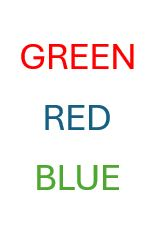

<style>
h1, h2, h3, h4, h5, h6 {
  direction: rtl;
}
p {
  direction: rtl;
}

.text-block1 {
  direction: rtl;       /* Set text direction to right-to-left */
  text-align: right;
  background-color: #f0f0f0; /* Light grey background */
  padding: 10px;
  border-radius: 5px;
  border: 1px solid #ddd; /* Light border */
  margin: 10px 0; /* Space around the block */
  
</style>

```{r setup, include=FALSE}
library(learnr)
library(gradethis)
library(Rcourse)

tutorial_options(
  exercise.timelimit = 60,
  # A simple checker function that just returns the message in the check chunk
  exercise.checker = function(check_code, ...) {
    list(
      message = eval(parse(text = check_code)),
      correct = logical(0),
      type = "info",
      location = "append"
    )
  }
)

knitr::opts_chunk$set(error = TRUE)
gradethis::gradethis_setup()
```

## מבוא

### תרגיל מסכם

היחידה שלפניכם כוללת תרגיל המסכם את רוב החומר שנלמד בסמסטר א'.
 
קובץ זה ילווה אתכם בניתוח ,שיכלול את כל השלבים בניתוח נתונים אמיתיים - החל מסינון ובקרת
איכות הנתונים ועד להפקת תרשימים עבור התוצאות. אפשר ומומלץ להציץ שוב ביחידות הקודמות או בסיכומים שיצרתם לעצמכם במידת הצורך.


{width="100"}


את התרגיל עצמו יש לפתור בRstudio. בסוף התרגיל תתבקשו להעלות למודל את קובץ הקוד שיצרתם.
הקפידו לשמור אותו נקי ומסודר ולהוסיף הערות המפרטות את מטרת כל אחד מהשלבים בקוד.

בנוסף, היחידה תכלול שאלות שנועדו לעזור לכם לוודא את הניתוחים שלכם במהלך הדרך. כמו ביחידות הקודמות, גם הפעם תתבקשו להגיש את קוד הHash שקיבלתם עם סיום היחידה. 


בהצלחה!


### תיאור הנתונים

בתרגיל ננתח נתונים ממטלת "סטרופ". במטלה זו נבדקים מתבקשים לציין את ה**צבע** של
מילים שונות המופיעות על המסך, תוך התעלמות מהתוכן שלהן. 
  
למשל, בגירויים הבאים הנבדק היה צריך להגיב "אדום", "כחול" ואז "ירוק"

{width="100"}

כשהמילה שמופיעה תואמת לצבע בו היא כתובה המטלה הינה קלה יחסית - ולכן מצופה מנבדקים להגיב באופן
תקין ובמהירות רבה יותר, אך כשיש חוסר תאימות בין הצבע לטקסט המטלה קשה
יותר וזמן התגובה צפוי להתארך.

ניתן להתנסות בגרסה אינטרנטית של המטלה [בקישור
זה](https://www.psytoolkit.org/experiment-library/experiment_stroop.html).

  
הנתונים איתם נעבוד נאספו במסגרת פרוייקט שכלל מספר מעבדות באוניברסיטאות שונות, במסגרתו סוללה של מטלות ושאלונים הועברה על ידי מספר אוניברסטאות ומכללות שונות על מנת להבטיח את אמינות הנתונים שנאספו. בנוסף, [הנתונים פורסמו לקהל הרחב](https://osf.io/ct89g/?view_only=) על מנת לאפשר לחוקרים אחרים לבצע עליהם ניתוחים נוספים ולבדוק בעצמם את תקינות המבחנים הסטטיסטיים.

לטובת התרגיל נשתמש בתוצאות מטלת הסטרופ ו2 קבצים מידע אודות הנבדקים (הכוללים פירוט על גילאי הנבדקים והמוסד והתאריך בו כל נבדק ביצוע את הניסוי). כל הקבצים נמצאים בתיקייה הרלוונטית באתר המודל.
 
 
## יבוא

הורידו מהמודל את הטבלה "stroop_data.csv" וייבאו אותה לסביבת העבודה שלכם.

הטבלה מכילה פרטים אודות כל סבב במטלה: על איזה נבדק מדובר (session_id),
מה היה מספר הסבב (trial), איזה גירוי הוצג (המילה שהוצגה + צבע הטקסט), מה
היתה התגובה של הנבדק ומה היה אורך זמן התגובה שלו (במילישניות).

האפקט העיקרי שמעניין אותנו במטלה זו הוא ההפרש בין זמן התגובה עבור סבבים בהם הייתה תאימות
בין הצבע והטקסט של הגירוי לבין שלבים בהם הצבע והטקסט לא תאמו זה לזה.

כדי שנוכל להפיק את מדד זה ולבצע את הסינונים הנדרשים נצטרך לייצר שתי עמודות נוספות מתוך
הנתונים הקיימים בטבלה:

   **1)** עמודת המתארת האם הנבדק צדק או טעה בסבב המדובר. עמודה זו תבחן האם התגובה של
הנבדק זהה ל**צבע** של הגירוי.

   **2)** עמודה שתקודד את התנאי אליו שייך כל סבב - האם קיימת התאמה בין צבע הגירוי לטקסט שמופיע בו.


## סיכום ראשוני

לאחר שיצרתם את שתי העמודות הנ"ל, צרו סיכום ראשוני של הנתונים.
מטרת סיכום זה היא לוודא את התקינות של הנתונים שלנו ולראות שהם מתאימים למבנה המטלה. אנחנו מצפים שכל נבדק יצפה בכל אחד מהגירויים האפשריים כמות זהה של פעמים, ולכן שליש מכל הסבבים צפויים להיות מהתנאי התואם.

עבור כל
נבדק, בדקו כמה סבבים הוא ביצע, כמה מתוכם היו מתנאי חוסר התאימות בין
הצבע לטקסט ומה אחוז הסבבים בהם הוא השיב תגובה נכונה (אחוז דיוק).


```{r correct_percent, echo = FALSE}

question_text( 
  "<div style='direction: rtl;'>
מה היה אחוז הדיוק של הנבדק השני (session_id = 668587)? 
  </div>",
  answer("0.889", correct = TRUE),
  answer("0.89", correct = TRUE),
  answer("0.8888889",correct=TRUE),
  allow_retry = TRUE
)

```

```{r percent_congruent, echo = FALSE}

question( 
  "<div style='direction: rtl;'>
האם אחוז הסבבים בהם הייתה התאמה בין הצבע לטקסט תואמת לציפיות שלנו?
  </div>",
  answer("כן", correct = TRUE),
  answer("לא"),
  allow_retry = TRUE
)

```


## סינון נתונים

### ערכים קיצוניים

כדי להבין האם יש בנתונים שלנו תצפיות קיצוניות ניעזר בהצגת זמני התגובה
בהיסטוגרמה. צרו היסטוגרמה שכזהו באמצעות `ggplot`.

משהו נראה קצת מוזר?

הסיבה לכך היא שככל הנראה ישנן מספר תצפיות קיצוניות מאוד, שגורמות לתוכנה
להציג את זמני התגובה על ציר מאוד רחב - כשבפועל רוב זמני התגובה מרוכזים
בקצה השמאלי של הציר.

ציירו את ההיסטוגרמה שוב - אך הפעם הגבילו את ציר האיקס בין 0 ל5000.

על פי התוצאות המוצגות בטבלה, מהו לדעתכם הרף העליון הסביר לזמני התגובה?


לפני שנוכל להתקדם נצטרך לסנן את הנתונים כך שלא יכללו תוצאות קיצוניות ובלתי סבירות. תוצאות כאלו
יכולות לנבוע מכך שנבדק איבד ריכוז במטלה או לקח הפסקה קצרה ואינן משקפות
את זמן התגובה האמיתי של הנבדק. במידה ונשאיר את תצפיות אלו הן עלולות
להטות את התוצאות שלנו באופן משמעותי - ולכן חשוב שנסנן אותן לפני חישוב
הממוצעים.

סננו את הטבלה כך שתכיל רק זמני תגובה הקטנים מ3000 מילי שניות.ישנן מספר דרכים שונות לקבוע את נקודת החתך, אך כרגע נסתפק
בחתך אחיד זה כדי להקל על שיחזור והשוואת תוצאות הניתוח.


```{r n_filtered, echo = FALSE}

question_text( 
  "<div style='direction: rtl;'>
כמה תצפיות סיננתם?
  </div>",
  answer("629", correct = TRUE),
  allow_retry = TRUE
)

```


### סינון סבבים עם תגובות שגויות

בנוסף, סננו מהטבלה גם את כל הסבבים בהם הנבדקים טעו בתגובותיהם. סבבים
כאלו מעידים על כך שהמטלה לא נעשתה כשורה ולכן לא נרצה לכלול את זמני
התגובה של סבבים אלו בממוצעים שנחשב.

```{r are_there_NAs, echo = FALSE}

question( 
  "<div style='direction: rtl;'>
בדקו - האם הקובץ מכיל ערכים חסרים?
  </div>",
  answer("כן"),
  answer("לא", correct = TRUE),
  allow_retry = TRUE
)

```


## סינון נבדקים בעייתיים

הסינון האחרון שנערוך יכלול הסרה של כל הנתונים של נבדקים שצדקו בפחות מ50%
מהסבבים. אמנם הסיכוי לצדוק בניחוש אקראי הינו נמוך יותר במקרה זה (33%),
אך נוסיף לרף הדחייה שלנו מרווח נוסף עבור נבדקים שאמנם לאו דווקא ניחשו
בכל סבב וסבב אך בהחלט נראה שלא ענו על המטלה בצורה טובה מספיק.

צרו רשימה של נבדקים עם אחוזי דיוק נמוכים והסירו את כל התצפיות שלהם
מהקובץ.

```{r n_filtered_total, echo = FALSE}

question_text( 
  "<div style='direction: rtl;'>
לאחר כל הסינונים, כמה תצפיות נותרו בקובץ?
  </div>",
  answer("201511", correct = TRUE),
  allow_retry = TRUE
)

```


## חישוב ממוצעי זמני התגובה

עכשיו שסיננו את זמני התגובה ווידאנו שהנתונים תקינים - נוכל לחשב את זמן
התגובה הממוצע עבור כל נבדק בכל אחד מהתנאים.

נשתמש בממוצעים אלו כדי לחשב את ההפרש בין זמני
התגובה הממוצעים של כל נבדק בתנאים השונים, כך שבסוף התהליך נקבל מדד אחד עבור כל נבדק שמתאר את ההפרש בזמני התגובה בין התנאים עבור אותו נבדק.

  
צרו תרשים הממחיש את פיזור ההפרשים שקיבלתם. הדגישו את מיקומו של ערך האפס בתרשים שלכם כדי להבליט את מיקומם של רוב התצפיות ביחס אליו.

  
מהתרשמותכם - האם זה נראה שנבדקים נוטים להגיב לאט יותר באחד התנאים?


חשבו את ההפרש הממוצע על פני כל הנבדקים ואת סטיית התקן של ההפרשים


```{r stroop_mean, echo = FALSE}

question_text( 
  "<div style='direction: rtl;'>
מהו ממוצע ההפרשים שקיבלתם?
  </div>",
  answer("56.4", correct = TRUE),
  answer("56.37443", correct = TRUE),
  answer("56.3744", correct = TRUE),
  answer("56.374", correct = TRUE),
  answer("56.37", correct = TRUE),
  answer("56", correct = TRUE),
  answer("-56.4", correct = TRUE),
  answer("-56.37443", correct = TRUE),
  answer("-56.3744", correct = TRUE),
  answer("-56.374", correct = TRUE),
  answer("-56.37", correct = TRUE),
  answer("-56", correct = TRUE),
  allow_retry = TRUE
)

```


## סיכום המטלה

צרו טבלה אחת המסכמת את תוצאות המטלה עבור כל נבדק וכוללת גם את ההפרש
בזמני התגובה וגם את אחוז הטעויות.

### תרשימים

צרו תרשימים שימחישו:

  **1)**  את הקשר בין אחוז הטעויות של נבדק לבין ההפרש בזמני התגובה בין
התנאים של אותו הנבדק.

  
  **2)** את זמני הגובה הממוצעים בכל תנאי ואת סטיית התקן שלהם.
  
לצורך חישוב הממוצע (מעבר לנבדקים) וסטיית התקן לטובת התרשים תצטרכו להשתמש ב**ממוצעי** זמני התגובה של כל נבדק בתנאים השונים (ולא בזמני התגובה הגולמיים - מה שהיה נותן משקל עודף לנבדקים עם מספר גבוה יותר של תצפיות תקינות).

  
  **3)** את ממוצע הפרשי זמני התגובה בין התנאים עבור כל אחת מהאוניברסטאות / מוסדות בה המחקר נעשה.
  
המידע הנוסף שתצטרכו לצורך ניתוח זה נמצא בקבצים "stroop_subj_data_part_1" ו"stroop_subj_data_part_2".


### בדיקת תוצאות

כדי לבדוק שהניתוחים נעשו כהלכה ענו על השאלות הבאות:


```{r sd_congruent, echo = FALSE}

question_text( 
  "<div style='direction: rtl;'>
מה היתה סטיית התקן זמן התגובה בתנאי התואם?
  </div>",
  answer("133", correct = TRUE),
  answer("132.6728", correct = TRUE),
  answer("132.673", correct = TRUE),
  answer("132.67", correct = TRUE),
  answer("132.7", correct = TRUE),
  allow_retry = TRUE
)

```


```{r mean_diff_ashland_university, echo = FALSE}

question_text( 
  "<div style='direction: rtl;'>
מה היה ממוצע הפרשי זמני התגובה באוניברסיטת Ashland?
  </div>",
  answer("-57.48028", correct = TRUE),
  answer("-57.4803", correct = TRUE),
  answer("-57.480", correct = TRUE),
  answer("-57.48", correct = TRUE),
  answer("-57.5", correct = TRUE),
  answer("-57", correct = TRUE),
  answer("57.48028", correct = TRUE),
  answer("57.4803", correct = TRUE),
  answer("57.480", correct = TRUE),
  answer("57.48", correct = TRUE),
  answer("57.5", correct = TRUE),
  answer("57", correct = TRUE),
  allow_retry = TRUE
)

```
  


## הגשה

עברו על הקובץ וודאו שהגשתם את כל התרגילים ועניתם על כל השאלות

במידה וכל התשובות שלכם תקינות יש ללחוץ על הכפתור: Generate, להעתיק את
הטקסט שמופיע בחלון למטה ולהגישו במודל

שימו לב: בתרגיל זה יש להגיש גם את קוד הhash שקיבלתם וגם את קובץ הR עצמו

בהצלחה!

```{r context="server"}
learnrhash::encoder_logic()
```

```{r encode, echo=FALSE}
learnrhash::encoder_ui()
```
